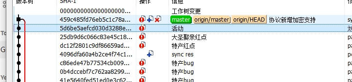
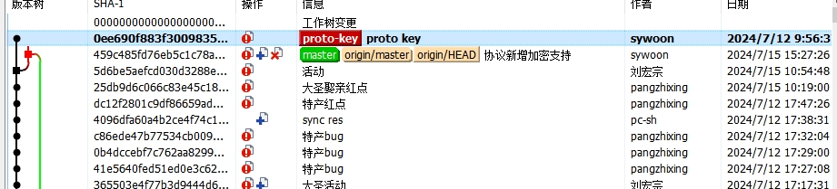
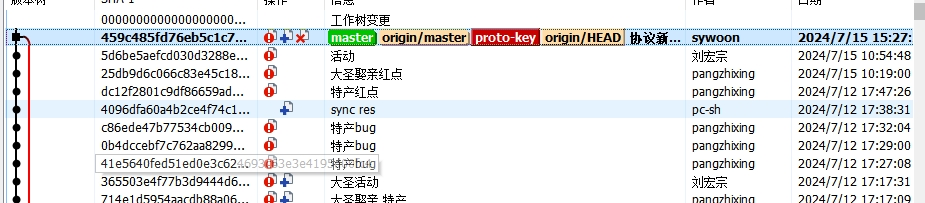

## 远程和本地图片
三种方式通过docsify在github.io中测试都通过  


  
这里是相对路径，若在根目录下，可直接使用doc/lua.png


## 配置
```
git config --global user.name sywoon
git config --global user.email sywoon@163.com
git config --global color.ui auto

git config --global core.editor nvim
git config --global core.ignorecase false

:: false: pull push do nothing  in only windows
:: input: push change crlf to lf   pull do nothing  in linux
:: true: pull push both change   in window and linux
git config --global core.autocrlf false

git config --global sendpack.sideband false
git config --global push.default simple

git config --global diff.tool bc4
git config --global difftool.bc4.cmd "\"c:/program files/beyond compare/bcomp.exe\" \"$LOCAL\" \"$REMOTE\""

git config --global merge.tool bc4
git config --global mergetool.bc4.cmd "\"c:/program files/beyond compare/bcomp.exe\" \"$LOCAL\" \"$REMOTE\" \"$BASE\" \"$MERGED\""
git config --global mergetool.bc4.trustExitCode true

git config --global branch.master.rebase true
git config --global branch.release.rebase true

git config --global alias.co "checkout"
git config --global alias.br "branch"
git config --global alias.ci "commit"
git config --global alias.st "status"
git config --global alias.dt "difftool"
git config --global alias.logs "log --stat"
git config --global alias.logo "log --oneline"
git config --global alias.cp "cherry-pick"
```

## 本地新增分支 推送给远端：
```
git br -av 查看本地分支
git co master
git pull  更到最新
git co -b release 从本地master切分支到release
git push -u origin release
```

## 从远程获取新分支
```
git fetch   获取所有远程分支
git br -av 
git co -b release origin/release
```


## 添加远程github库
```
git remote add origin git@github.com:sywoon/eff_test.git
git push -u origin master
```

## 将XX分支的某个提交复制到XX分支
```
master的复制到relase
git checkout master
git pull 更新远端master代码
git checkout release
git pull 更新远端release代码
git logo -3 master 查看master分支最新三条log记录
git cherry-pick Hash   Hash是logo里找到要复制的提交的hash(记录前面的那串字母).cherry-pick可简写成cp
git push 推送提交

可多条记录一起提交
git cherry-pick <HashA> <HashB> 
```

## 本地开发分支和master主分支
正常master为稳定功能 若自己要开发新功能 应该开新的本地分支 比如：dev
开发过程中 若要更新master版本 只需要git rebase master即可

- 情况1：dev开发完 但没更新 合并到master

```
git co master
git pull
git merge dev
会将dev分支上的 记录A(a6ae)合并到master； 
本地和远程都可以看到合并分线 本地：可看到分支名称 远程：只有提交记录
```


- 情况2：操作失误 master上rebase了dev
```
git co master
git rebase dev 
分支会比较奇怪 原本master和origin/master是重叠的
从dev分支的前一个提交分叉 master和origin分开
master上多一个dev的记录A 后续origin上的提交会逐个重新提交到master
表现上 master和origin在A之后的提交记录都是一样的；
但是hash不同，因为rebase会重新提交，只是内容相同了 若有冲突后续推送会如何？

结论：
根据时间顺序重新排序master  并非将dev的记录放在master的尾部
```

- 情况3：dev上rebase master上的某个记录 而不是最新

```
git co dev
git rebase 5d6b  --master上的某条记录
master和dev表现都会不同
dev：合并A之后的所有master记录 并将A放到dev的末尾
master：保留了A以及合并记录  相当于情况1  也可能是先操作了合并
小结：
  dev和master上都有A的记录 但是hash不同 位置也不同
```


- 情况4：dev上rebase整个master

```
git co dev
git rebase master
表现上同情况1 
本地区别：可以同时在Merge记录上看到master和dev分支； 而情况1中dev分支在最下面
从开发角度  合并后dev分支可以删除了  远程能看到合并记录 但没有dev分支名
merge的记录 感觉和正常的记录有点不同  可以看到两个父节点信息 方便对比两边修改的差异
```


