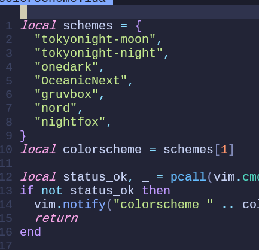
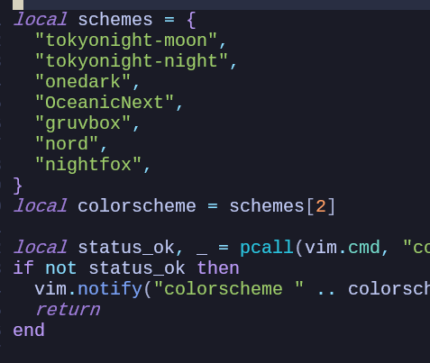
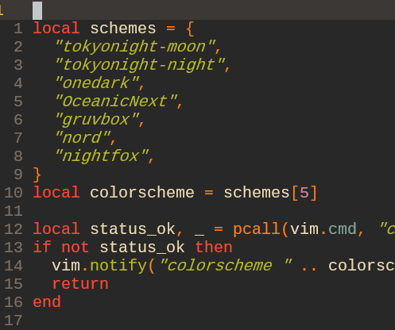
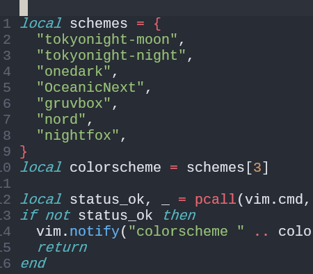
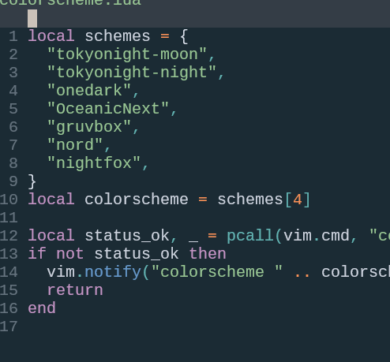
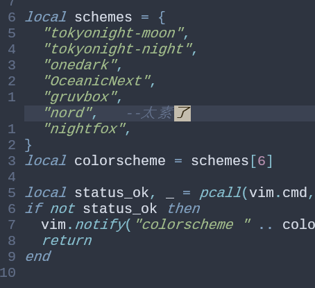
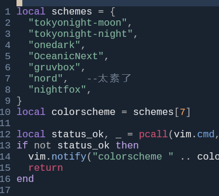

# 🔙[nvim root](/README?id=🔸neovim)
# 🔙​[nvim up](/docs/knowledge/neovim)

# Neovim 配置实战：从0到1打造自己的IDE
[参考文档]([Neovim 配置实战：从0到1打造自己的IDE](https://blog.csdn.net/qq_55125921/article/details/127177442))
[参考文档-另一个版本](https://developer.aliyun.com/article/1295874)
[github](https://github.com/nshen/learn-neovim-lua/tree/main)


## Neovim的安装与配置架构总览


### WSL2环境(WSL 是 Windows Subsystem for Linux)
参考别的文档安装wsl  用户名syw 密码:空格
wsl -l -v
```
NAME            STATE           VERSION
Ubuntu-24.04    Running         2
```


### 安装 Windows Terminal
多个选项卡、窗格、Unicode和 UTF-8 字符
GPU 加速文本渲染引擎以及自定义主题、样式和配置
注意：配色方案中 选择 One Half Dark 会和快捷键出现冲突
要选择包含 Nerd fonts 的字体。因为命令行中是不支持显示图标

-- [Nerd Fonts](https://www.nerdfonts.com/font-downloads)
  -- 是一个使用大量字体图标来解决程序员在开发过程中缺少合适字体的问题的项目
  -- 这样在命令行里就支持显示这些图标了
  -- 本身并不是一种新的字体，而是把常用图标以打补丁的方式打到了常用字体上
作者使用了FiraCode版本-FiraCodeNerdFont-Regular.ttf 同vscode中的字体

    -- terminal设置新的字体
    -- 控制台中验证字体：https://www.nerdfonts.com/cheat-sheet
        -- 输入a 显示的图标 右上角复制icon 到terminal中粘贴

## 安装nodejs
[参考](https://learn.microsoft.com/zh-tw/windows/dev-environment/javascript/nodejs-on-wsl)
```
sudo apt update && sudo apt upgrade
sudo apt-get install curl
curl -V

安装nvm 管理nodejs版本
curl -o- https://raw.githubusercontent.com/nvm-sh/nvm/master/install.sh | bash
nvm ls 查看已安装版本
nvm install --lts安装稳定版
or
nvim install node 安装最新版
node --version
```
- nvm安装失败
```
1 wsl中安装进度无反应：windows中开启open vpn代理
2. 报错
export NVM_DIR="$HOME/.nvm"
会自动到.zshrc末尾添加
export NVM_DIR="$HOME/.nvm"
[ -s "$NVM_DIR/nvm.sh" ] && \. "$NVM_DIR/nvm.sh"  # This loads nvm
[ -s "$NVM_DIR/bash_completion" ] && \. "$NVM_DIR/bash_completion"  # This loads nvm bash_completion
重启terminal  需要关闭整个 纯粹退出wsl还不够 
```
nvm --version
安装目录：/home/syw/.nvm/versions/node/v20.15.1/bin/node


## 安装unzip
sudo apt install unzip
后面安装lsp-lua server需要


## 安装 Neovim
```
sudo add-apt-repository ppa:neovim-ppa/unstable
sudo apt-get update
sudo apt-get install neovim
若报错 安装依赖项：
sudo apt-get install software-properties-common
```
- nvim -v   注意别输入大写的V  会显示一堆的内容


### 配置
- wsl: ~/.bashrc
```
alias vim='nvim'
alias vi='nvim'
```

- git bash; oh-my-zsh;
```
  .bash_profile  启动bash后 加载这3个文件
  test -f ~/.profile && . ~/.profile
  test -f ~/.bashrc && . ~/.bashrc

  .bashrc   启动bash后 自动启动zsh； exit可退出
  if [ -t 1 ]; then
    exec zsh
  fi

  .oh-my-zsh  从官方下载 复制到%HOME目录 C:\Users\S

  .zshrc  在原生版本基础上新增
  #开启终端代理
  function proxyon() {
    export http_proxy="http://127.0.0.1:7890"
    export https_proxy=$http_proxy
    echo -e "terminal proxy on"
  }

  #关闭终端代理
  function proxyoff() {
    unset http_proxy
    unset https_proxy
    echo -e "terminal proxy off"
  }

  # alias grep='grep --color=auto'
  alias py='python3';
  alias pip='pip3';
  alias lg='lazygit';

  export ZSH="$HOME/.oh-my-zsh"  加了双引号
  ZSH_THEME="powerlevel10k/powerlevel10k"
  if type nvim > /dev/null 2>&1; then
    alias vi='nvim'
    alias vim='nvim'
  fi
  
  setClip() { osascript -e 'set the clipboard to "'"${*}"'" as text'; }
```


### 入口
不再是.vimrc儿时~/.config/nvim/init.lua  %userprofile%/AppData/Local/nvim/init.lua
数据文件夹：~/.local/share/nvim   %userprofile%/AppData/Local/nvim-data
:h base-directories  标准数据目录

#### 早期版本支持init.nvim
```
lua print('single lua')

lua <<EOF
print('multi lua')
print('multi lua')
EOF

lua require('basic')
```


#### 新版本 init.lua
```
require('basic')
按照nvim规则 会寻找%runtimepath%/lua文件夹 可以是basic.lua或basic/init.lua
```

-- lua/basic.lua
```lua
-- utf8
vim.g.encoding = "UTF-8"
vim.o.fileencoding = 'utf-8'

-- 鼠标支持
vim.o.mouse = "a"
vim.opt.clipboard = 'unnamedplus' -- use system clipboard

-- 使用相对行号
vim.wo.number = true
vim.wo.relativenumber = true

-- 高亮所在行
vim.wo.cursorline = true
-- 显示左侧图标指示列
vim.wo.signcolumn = "yes"
-- 右侧参考线，超过表示代码太长了，考虑换行
vim.wo.colorcolumn = "80"
-- jkhl 移动时光标周围保留8行
vim.o.scrolloff = 8
vim.o.sidescrolloff = 8
-- 缩进2个空格等于一个Tab
vim.o.tabstop = 4
vim.bo.tabstop = 4
vim.o.softtabstop = 4
vim.o.shiftround = true
-- >> << 时移动长度
vim.o.shiftwidth = 4
vim.bo.shiftwidth = 4
-- 空格替代tab
vim.o.expandtab = true
vim.bo.expandtab = true
-- 新行对齐当前行
vim.o.autoindent = true
vim.bo.autoindent = true
vim.o.smartindent = true

-- 搜索大小写不敏感，除非包含大写
vim.o.ignorecase = true
vim.o.smartcase = true
-- 搜索不要高亮
vim.o.hlsearch = false
-- 边输入边搜索
vim.o.incsearch = true

-- 命令行高为2，提供足够的显示空间
vim.o.cmdheight = 2
-- 当文件被外部程序修改时，自动加载
vim.o.autoread = true
vim.bo.autoread = true

-- 禁止折行
vim.wo.wrap = false
-- 光标在行首尾时<Left><Right>可以跳到下一行
vim.o.whichwrap = '<,>,[,]'
-- 允许隐藏被修改过的buffer
vim.o.hidden = true

-- 禁止创建备份文件
vim.o.backup = false
vim.o.writebackup = false
vim.o.swapfile = false

-- smaller updatetime
vim.o.updatetime = 300
-- 设置 timeoutlen 为等待键盘快捷键连击时间500毫秒，可根据需要设置
vim.o.timeoutlen = 500
-- split window 从下边和右边出现
vim.o.splitbelow = true
vim.o.splitright = true

-- 自动补全不自动选中
vim.g.completeopt = "menu,menuone,noselect,noinsert"
-- 样式
vim.o.background = "dark"
vim.o.termguicolors = true
vim.opt.termguicolors = true

-- 不可见字符的显示，这里只把空格显示为一个点
vim.o.list = false 
vim.o.listchars = "space:·"
-- 补全增强
vim.o.wildmenu = true
-- Dont' pass messages to |ins-completin menu|
vim.o.shortmess = vim.o.shortmess .. 'c'
-- 补全最多显示10行
vim.o.pumheight = 10
-- 永远显示 tabline
vim.o.showtabline = 2
-- 使用增强状态栏插件后不再需要 vim 的模式提示
vim.o.showmode = false
```

- 配置说明
```
vim.g.{name}: 全局变量
vim.b.{name}: 缓冲区变量
vim.w.{name}: 窗口变量
vim.bo.{option}: buffer-local 选项
vim.wo.{option}: window-local 选项

确实很难判断应该放在哪个分类里
全部设置在 vim.opt 下也是可以的，例如 vim.opt.number = true 也是有效的

默认情况下，编辑器底部会以文本方式显示当前模式如： -- INSERT -- ， -- VISUAL --
后面用插件代替 所以这里showmode=false
```


#### 如何设置快捷键以提高开发效率
配置自己喜欢的快捷键
```
  s表示split
  sh 水平分屏 split horizontally
  sv 垂直分屏 split vertically
  sc 关闭窗口 close
  so 关闭其他 others
  alt+h/j/k/l 跳转窗口

  把所有快捷键都放在一个配置文件中管理，方便我们后续查找和修改
```

#### 如何在 Neovim 中设置快捷键
* vim.api.nvim_set_keymap() 全局快捷键
* vim.api.nvim_buf_set_keymap() Buffer 快捷键  一般是在某些异步回调函数里指定

* vim.api.nvim_set_keymap('模式', '按键', '映射为', 'options')
* vim.keymap.set({ "n", "i", "v" }, '按键', '映射为')
```
n Normal 模式
i Insert 模式
v Visual 模式
t Terminal 模式
c Command 模式

options 大部分会设置为 { noremap = true, silent = true }
noremap 表示不会重新映射 防止跳转映射 A -> B + B -> C => A->C
silent 为 true，表示不会输出多余的信息
```

- lua/keybindings.lua
```lua
-- leader key 是你常用的前缀
vim.g.mapleader = " "
vim.g.maplocalleader = " "

-- 取消 s 默认功能
map("n", "s", "", opt)
-- windows 分屏快捷键
map("n", "sv", ":vsp<CR>", opt)
map("n", "sh", ":sp<CR>", opt)
-- 关闭当前
map("n", "sc", "<C-w>c", opt)
-- 关闭其他
map("n", "so", "<C-w>o", opt)
-- Alt + hjkl  窗口之间跳转
map("n", "<A-h>", "<C-w>h", opt)
map("n", "<A-j>", "<C-w>j", opt)
map("n", "<A-k>", "<C-w>k", opt)
map("n", "<A-l>", "<C-w>l", opt)
-- 后期加了lsp后 就可以svgd来跳转定义

--ctrl+上下左右 调整窗口大小
-- 左右比例控制
map("n", "<C-Left>", ":vertical resize -2<CR>", opt)
map("n", "<C-Right>", ":vertical resize +2<CR>", opt)
map("n", "s,", ":vertical resize -20<CR>", opt)
map("n", "s.", ":vertical resize +20<CR>", opt)
-- 上下比例
map("n", "sj", ":resize +10<CR>", opt)
map("n", "sk", ":resize -10<CR>", opt)
map("n", "<C-Down>", ":resize +2<CR>", opt)
map("n", "<C-Up>", ":resize -2<CR>", opt)
-- 等比例
map("n", "s=", "<C-w>=", opt)


-- 扩展到 Terminal 模式
-- Neovim 内置的命令行要用<C-\><C-N> 退出
-- Terminal相关
map("n", "<leader>t", ":sp | terminal<CR>", opt)
map("n", "<leader>vt", ":vsp | terminal<CR>", opt)
map("t", "<Esc>", "<C-\\><C-n>", opt)
map("t", "<A-h>", [[ <C-\><C-N><C-w>h ]], opt)
map("t", "<A-j>", [[ <C-\><C-N><C-w>j ]], opt)
map("t", "<A-k>", [[ <C-\><C-N><C-w>k ]], opt)
map("t", "<A-l>", [[ <C-\><C-N><C-w>l ]], opt)

shift+a 跳转到命令行末尾 就可以输入命令 和普通控制台无异
A-h/j/k/l后 变成了vim模式下的文本 
如果是临时运行bat  感觉可以代替tmux使用了
```


#### Visule 模式下快捷键
```
-- visual模式下缩进代码
map("v", "<", "<gv", opt)
map("v", ">", ">gv", opt)
-- 上下移动选中文本
map("v", "J", ":move '>+1<CR>gv-gv", opt)
map("v", "K", ":move '<-2<CR>gv-gv", opt)

```


#### 浏览代码快捷键
C-u C-d 上下滚动代码 每次半屏幕 速度太快
```lua
-- 上下滚动浏览  C-h/l用于buffer跳转
map("n", "<C-j>", "4j", opt)
map("n", "<C-k>", "4k", opt)
-- ctrl u / ctrl + d  只移动9行，默认移动半屏
map("n", "<C-u>", "9k", opt)
map("n", "<C-d>", "9j", opt)
```

#### 其他快捷键
```lua
-- 在visual 模式里粘贴不要复制
map("v", "p", '"_dP', opt)

-- 退出
--map("n", "q", ":q<CR>", opt)
--map("n", "qq", ":q!<CR>", opt)
--map("n", "Q", ":qa!<CR>", opt)
map("n", "qq", ":wq<CR>", opt)
mapex({ "n", "i", "v" }, "<C-s>", "<ESC>:w<CR>")

-- insert 模式下，跳到行首行尾
map("i", "<C-h>", "<ESC>I", opt)
map("i", "<C-l>", "<ESC>A", opt)
map("i", "<C-j>", "<ESC>o", opt)
map("i", "<C-k>", "<ESC>O", opt)

map("i", "jk", "<ESC>", opt)
```


## 如何安装和管理插件
常见的插件管理器主要有 vim-plug 和 packer.nvim 两个
后期lazy.nvim后来居上

* vim-plug 的特点是使用简单，并且同时支持 Vim 和 Neovim，所有功能在一个 VIM 脚本中实现了
* Packer.nvim 是后起之秀，但功能更为强大，支持插件间的依赖，指定 commit 版本 使用全 lua 编写
作者23年后不再维护 推荐lazy.nvim 或 pckr.nvim

### 安装packer
为了学习 和原文一样使用packer 后期可改为lazy
```
git clone --depth 1 https://github.com/wbthomason/packer.nvim\
 ~/.local/share/nvim/site/pack/packer/start/packer.nvim
```

- lua/plugins.lua  专用于插件管理
使用use 'name/repo'来安装
```lua
local packer = require("packer")
packer.startup({
  function(use)
   -- Packer 可以管理自己本身
   use 'wbthomason/packer.nvim'   --对应https://github.com/wbthomason/packer.nvim
   -- 你的插件列表...
end,
config = {   
    display = {  --以浮动窗口打开安装列表
        open_fn = function()
            return require("packer.util").float({ border = "single" })
        end,
    },
    -- 并发数限制
    max_jobs = 16,
    -- 自定义源
    git = {  --若github连接不上 可以用代理点；但是可能没冷门插件，或更新不及时
      -- default_url_format = "https://hub.fastgit.xyz/%s",
      -- default_url_format = "https://mirror.ghproxy.com/https://github.com/%s",
      -- default_url_format = "https://gitcode.net/mirrors/%s",
      -- default_url_format = "https://gitclone.com/github.com/%s",
    },
  },
})
```

#### Packer常用命令
* :PackerCompile： 每次改变插件配置时，必须运行此命令或 PackerSync, 重新生成编译的加载文件
* :PackerClean ： 清除所有不用的插件
* :PackerInstall ： 清除，然后安装缺失的插件
* :PackerUpdate ： 清除，然后更新并安装插件 包含：clean+install
* :PackerSync : 执行 PackerUpdate 后，再执行 PackerCompile 包含:update+compile
* :PackerLoad : 立刻加载 opt 插件
**修改为plugins.lua后保存退出 下次:PackerSync就行了**


#### 安装的位置
:h base-directories  标准数据目录
标准数据目录默认是 ~/.local/share/nvim/ ，你可以通过调用 :echo stdpath("data")来查看
Packer默认安装在 标准数据目录/site/pack/packer/start

- 每次修改完 自动安装插件
```lua
plugins.lua末尾添加：
-- 每次保存 plugins.lua 自动安装插件
pcall(
  vim.cmd,
  [[
    augroup packer_user_config
    autocmd!
    autocmd BufWritePost plugins.lua source <afile> | PackerSync
    augroup end
  ]]
)

BufWritePost 事件时，如果改的是 lua/plugins.lua 文件，就自动重新加载并调用 :PackerSync 命令
```


## Neovim主题配色与优秀主题推荐
nvovim内置主题 :colorscheme Tab键
都保存在 $VIMRUNTIME/colors/ 目录
:echo $VIMRUNTIME   /usr/share/nvim/runtime


- lua/colorscheme.lua
```lua
local colorscheme = "tokyonight"
local status_ok, _ = pcall(vim.cmd, "colorscheme " .. colorscheme)
if not status_ok then
  vim.notify("colorscheme " .. colorscheme .. " 没有找到！")
  return
end
```
配置后 并不会起效果 需要到plugins.lua里安装
```
packer.startup({
  function(use)
    --------------------- colorschemes --------------------
    -- tokyonight
    use("folke/tokyonight.nvim")
    -------------------------------------------------------
```
由于监控了文件 所以保存后会自动安装插件 重启生效

**通常我们都会选择专门为 Neovim 制作的第三方主题，因为它们大多都会支持基于 TreeSitter 的语法高亮**
* 必须支持 nvim-treesitter 语法高亮
* 支持很多流行 Lua 插件的配色

[所有颜色插件](https://github.com/topics/neovim-colorscheme)

- catppuccin/catppuccin  star非常高
支持Treesitter, LSP, Telescope
```
  use {'catppuccin/nvim'}

  vim.g.catppuccin_theme = "concrete"
  require('catppuccin').setup{}
  or
  pcall(vim.cmd, "colorscheme " .. colorscheme)

  这两种都没成功 倒是之前lazy默认就用了这个主题
  require("lazy").setup(
    { "catppuccin/nvim", name = "catppuccin", priority = 1000 }
    )
  vim.cmd.colorscheme("catppuccin")
```

- 作者推荐的主题
```lua
    --------------------- colorschemes --------------------
    -- tokyonight
    --移植自 Visual Studio Code TokyoNight theme
    use("folke/tokyonight.nvim")  
    -- lazy安装默认的主题 支持treesitter lsp等 
    use {'catppuccin/nvim'}
    -- OceanicNext
    --受 Oceanic Next for Sublime 启发而制作的主题 但只是用到了基础色系
    use("mhartington/oceanic-next")  
    -- gruvbox
    -- 配色 gruvbox community 的 Lua 移植版本
    use({ "ellisonleao/gruvbox.nvim", requires = { "rktjmp/lush.nvim" } })
    -- zephyr 暂时不推荐，详见上边解释
    -- 作者还是中国人，可惜在某次 Treesitter 更新后就与该配色冲突了
    -- use("glepnir/zephyr-nvim")
    -- nord 颜色偏素
    use("shaunsingh/nord.nvim")
    -- onedark
    use("ful1e5/onedark.nvim")
    -- nightfox 
    -- 包含多种配色 Nightfox / Nordfox / Dayfox / Dawnfox / Duskfox
    use("EdenEast/nightfox.nvim")
    -------------------------------------------------------
```
- lua/colorscheme.lua
```lua
local schemes = {
  "tokyonight-moon",
  "tokyonight-night",
  "onedark",
  "OceanicNext",
  "gruvbox",
  "nord",   --太素了
  "nightfox",
}
local colorscheme = schemes[7]
local status_ok, _ = pcall(vim.cmd, "colorscheme " .. colorscheme)
if not status_ok then
  vim.notify("colorscheme " .. colorscheme .. " 没有找到！")
  return
end
```
---
tokyonight-moon   
  
tokyonight-night   
  
onedark  
  
OceanicNext  
  
gruvbox  
  
nord   --太素了  
  
nightfox  
  


## 如何给Neovim增加侧边栏文件浏览器

- nvim-tree
```
setup
  -- nvim-tree
  use({ "kyazdani42/nvim-tree.lua", requires = "kyazdani42/nvim-web-devicons" })
```

配置 独立另起插件配置文件夹
lua/plugin-config/nvim-tree.lua
由于新版本view.mappings已经失效 得重新实现绑定功能
```lua
  local status, nvim_tree = pcall(require, "nvim-tree")
if not status then
    vim.notify("没有找到 nvim-tree")
  return
end

-- 等价local nvim_tree = require "nvim-tree"
-- 若没这个插件 nvim会崩溃

local function my_on_attach(bufnr)
  local api = require "nvim-tree.api"

  local function opts(desc)
    return { desc = "nvim-tree: " .. desc, buffer = bufnr, noremap = true, silent = true, nowait = true }
  end

  -- default mappings
  api.config.mappings.default_on_attach(bufnr)

  -- custom mappings
  vim.keymap.set('n', '<C-t>', api.tree.change_root_to_parent,        opts('Up'))
  vim.keymap.set('n', '?',     api.tree.toggle_help,                  opts('Help'))
end

-- 列表操作快捷键
-- local list_keys = require('keybindings').nvimTreeList
nvim_tree.setup({
    -- 不显示 git 状态图标
    git = {
        enable = false,
    },
    -- project plugin 需要这样设置
    update_cwd = true,
    update_focused_file = {
        enable = true,
        update_cwd = true,
    },
    -- 隐藏 .文件 和 node_modules 文件夹
    filters = {
        dotfiles = true,
        custom = { 'node_modules' },
    },
    sort = {
        sorter = "case_sensitive",
    },
    on_attach = my_on_attach,
    view = {
        -- 宽度
        width = 30,
        -- 也可以 'right'
        side = 'left',
        -- 隐藏根目录 失效了
        -- hide_root_folder = false,
        -- 自定义列表中快捷键
        -- mappings = {
        --     custom_only = false,
        --     list = list_keys,
        -- },
        -- 不显示行数
        number = false,
        relativenumber = false,
        -- 显示图标
        signcolumn = 'yes',
    },
    actions = {
        open_file = {
            -- 首次打开大小适配
            resize_window = true,
            -- 打开文件时关闭
            quit_on_open = true,
        },
    },
    -- wsl install -g wsl-open
    -- https://github.com/4U6U57/wsl-open/
    system_open = {
        cmd = 'wsl-open', -- mac 直接设置为 open
    },
})

-- Highlight
vim.cmd([[
    :hi      NvimTreeExecFile    guifg=#ffa0a0
    :hi      NvimTreeSpecialFile guifg=#ff80ff gui=underline
    :hi      NvimTreeSymlink     guifg=Yellow  gui=italic
    :hi link NvimTreeImageFile   Title
]])

-- 自动关闭
vim.cmd([[
  autocmd BufEnter * ++nested if winnr('$') == 1 && bufname() == 'NvimTree_' . tabpagenr() | quit | endif
]]
)
```
- 配置说明
```
  1. system_open 项，如果想要在 WSL 中用 Windows 系统默认设置打开文件
  需要使用 Node.js 全局安装一个 wsl-open 包，使用命令 npm install -g wsl-open
  不是很清楚 什么用途？

  2. 参数很多
  :h nvim-tree.setup
```

- 按键绑定
lua/keybinds.lua
```lua
-- nvim-tree
-- alt + m 键打开关闭tree
map("n", "<A-m>", ":NvimTreeToggle<CR>", opt)
```
* o 打开关闭文件夹
* a 创建文件
* r 重命名
* x 剪切
* c 拷贝
* p 粘贴
* d 删除


## 如何给Neovim增加顶部标签页与底部信息显示栏？
通过 bufferline.nvim 和 lualine.nvim 插件

### bufferline.nvim
```lua
  -- bufferline
  use({ "akinsho/bufferline.nvim", requires = { "kyazdani42/nvim-web-devicons", "moll/vim-bbye" }})
```
 vim-bbye 依赖，因为这个插件安装后会增加一个 :Bdelete 命令，相比内置的 :bdelete, 它删除 buffer 的同时，并不会搞乱布局

- lua/plugin-config/bufferline.lua
```lua
local status, bufferline = pcall(require, "bufferline")
if not status then
    vim.notify("没有找到 bufferline")
  return
end

-- bufferline 配置
-- https://github.com/akinsho/bufferline.nvim#configuration
bufferline.setup({
  options = {
    -- 关闭 Tab 的命令，这里使用 moll/vim-bbye 的 :Bdelete 命令
    close_command = "Bdelete! %d",
    right_mouse_command = "Bdelete! %d",
    -- 侧边栏配置
    -- 左侧让出 nvim-tree 的位置，显示文字 File Explorer
    offsets = {
      {
        filetype = "NvimTree",
        text = "File Explorer",
        highlight = "Directory",
        text_align = "left",
      },
    },
    -- 使用 nvim 内置 LSP  后续课程会配置
    diagnostics = "nvim_lsp",
    -- 可选，显示 LSP 报错图标
    ---@diagnostic disable-next-line: unused-local
    diagnostics_indicator = function(count, level, diagnostics_dict, context)
      local s = " "
      for e, n in pairs(diagnostics_dict) do
        local sym = e == "error" and " " or (e == "warning" and " " or "")
        s = s .. n .. sym
      end
      return s
    end,
  },
})
```

- keybindings.lua
```lua
-- bufferline
-- 左右Tab切换
map("n", "<C-h>", ":BufferLineCyclePrev<CR>", opt)
map("n", "<C-l>", ":BufferLineCycleNext<CR>", opt)

-- 关闭
--"moll/vim-bbye"  解决关闭显示错乱问题
map("n", "<leader>bc", ":Bdelete!<CR>", opt)
map("n", "<leader>bo", ":BufferLineCloseOthers<CR>", opt)
-- map("n", "<leader>bl", ":BufferLineCloseRight<CR>", opt)
-- map("n", "<leader>bh", ":BufferLineCloseLeft<CR>", opt)
-- map("n", "<leader>bc", ":BufferLinePickClose<CR>", opt)
```

### lualine.nvim
该插件无需快捷键
```
  -- lualine
  use({ "nvim-lualine/lualine.nvim", requires = { "kyazdani42/nvim-web-devicons" } })
  use("arkav/lualine-lsp-progress")
```

- lua/plugin-config/lualine.lua
```lua
-- 如果找不到lualine 组件，就不继续执行
local status, lualine = pcall(require, "lualine")
if not status then
    vim.notify("没有找到 lualine")
  return
end

lualine.setup({
  options = {
    theme = "tokyonight",
    component_separators = { left = "|", right = "|" },
    -- https://github.com/ryanoasis/powerline-extra-symbols
    section_separators = { left = " ", right = "" },
  },
  extensions = { "nvim-tree", "toggleterm" },
  sections = {
    lualine_c = {
      "filename",
      {
        "lsp_progress",
        spinner_symbols = { " ", " ", " ", " ", " ", " " },
      },
    },
    lualine_x = {
      "filesize",
      {
        "fileformat",
        -- symbols = {
        --   unix = '', -- e712
        --   dos = '', -- e70f
        --   mac = '', -- e711
        -- },
        symbols = {
          unix = "LF",
          dos = "CRLF",
          mac = "CR",
        },
      },
      "encoding",
      "filetype",
    },
  },
})
```
- options 用于设置样式， 
  - theme 设置主题配色，可以设置为 auto， 也可以设置为主题列表中的一个
  - section_separators 设置分段分隔符， 
  - component_separators 设置分段中的组件分隔符

- extensions 用于设置 lualine 支持的扩展
  - 我们只会用到 nvim-tree 和 toggleterm

- sections 用于设置不同分段，所需显示的功能模块
  - 分段有 6 个，分别为： A B C X Y Z
```
+-------------------------------------------------+
| A | B | C                             X | Y | Z |
+-------------------------------------------------+
```
- 默认sections
```
sections = {
  lualine_a = {'mode'},
  lualine_b = {'branch', 'diff', 'diagnostics'},
  lualine_c = {'filename'},
  lualine_x = {'encoding', 'fileformat', 'filetype'},
  lualine_y = {'progress'},
  lualine_z = {'location'}
},
```
作者修改了c部分 用lsp_progress提供的信息 后面安装的arkav/lualine-lsp-progress来提供  
修改了x部分 默认的fileformat是用图标表示 
改成了vscode一样的LF/CRLF/CR 格式  


## 如何模糊搜索快速打开文件
类似vscode中的C-p查找文件
Ctrl + shift + f 来全局查找内容


- telescope
默认打开窗口后进入输入模式 esc后进入normal模式
用j/k来上下浏览 i/a回到输入模式
esc回到normal 再esc退出界面
```lua
  setup
    -- telescope
    use { 'nvim-telescope/telescope.nvim', requires = { "nvim-lua/plenary.nvim" } }
```
:checkhealth telescope 检查依赖情况
依赖BurntSushi/ripgrep or sharkdp/fd
根据系统环境来选择


### wsl2中安装ripgrep
```
sudo add-apt-repository ppa:x4121/ripgrep
sudo apt-get update
sudo apt install ripgrep

rg --version
```
安装fd  是否两个都需要？
```
npm install -g fd-find
fd --version
```
再次:checkhealth telescope 没有报错
但是还有warn
- WARNING nvim-treesitter not found. (Required for `:Telescope treesitter`.)
先不用理会 后续语法高亮会安装


### 使用命令
- :Telescope find_files

### 快捷键
```lua
-- Telescope
-- 查找文件
map("n", "<C-p>", ":Telescope find_files<CR>", opt)  
map("n", "<leader>ff", ":Telescope find_files<CR>", opt)  --默认
-- 全局搜索
map("n", "<C-f>", ":Telescope live_grep<CR>", opt) 
map("n", "<leader>fg", ":Telescope live_grep<CR>", opt)  --默认
-- 查找最近打开的buffers
map("n", "<leader>fb", ":Telescope buffers<CR>", opt)
-- map("n", "<leader>fh", ":Telescope help_tags<CR>", opt)
```
由于Neovim中没办法设置Ctrl + shift + f 快捷键，所以用了Ctrl + f

- Telescope 还支持在打开的窗口中自定义快捷键
```
-- Telescope 列表中 插入模式快捷键
pluginKeys.telescopeList = {
  i = {  --在输入状态时的快捷键
    -- 上下移动
    ["<C-j>"] = "move_selection_next",
    ["<C-k>"] = "move_selection_previous",
    ["<Down>"] = "move_selection_next",
    ["<Up>"] = "move_selection_previous",
    -- 历史记录
    ["<C-n>"] = "cycle_history_next",
    ["<C-p>"] = "cycle_history_prev",
    -- 关闭窗口
    ["<C-c>"] = "close",
    -- 预览窗口上下滚动
    ["<C-u>"] = "preview_scrolling_up",
    ["<C-d>"] = "preview_scrolling_down",
  },
}

```

- lua/plugin-config/telescope.lua
```lua
local status, telescope = pcall(require, "telescope")
if not status then
  vim.notify("没有找到 telescope")
  return
end

telescope.setup({
  defaults = {
    -- 打开弹窗后进入的初始模式，默认为 insert，也可以是 normal
    initial_mode = "insert",
    -- 窗口内快捷键
    mappings = require("keybindings").telescopeList,
  },
  pickers = {
    -- 内置 pickers 配置
    find_files = {
      -- 查找文件换皮肤，支持的参数有： dropdown, cursor, ivy
      -- theme = "dropdown",    都没默认的好看
    }
  },
  extensions = {
     -- 扩展插件配置
  },
})

```
测试发现快捷键无效  新版本也不支持这种写法了？ 像上面的nvimtree一样


### 基于telescope的第三方扩展
[web](https://github.com/nvim-telescope/telescope.nvim/wiki/Extensions)

- telescope-fzf-native.nvim
好像原生的也够用了  这个扩展了些什么？
Telescope 提供了一种统一的方式来访问和操作多种数据源，如文件系统、Git 历史、缓冲区列表等，而 fzf-native 作为其后端，提升了性能和响应速度。
```
  dependencies = {
  { 
      'nvim-telescope/telescope-fzf-native.nvim', 
      --build = 'make',
      build = 'cmake -S. -Bbuild -DCMAKE_BUILD_TYPE=Release && cmake --build build --config Release',
  },

  setup.extensions = {
        -- 扩展插件配置
        fzf = {
            fuzzy = true,                    -- false will only do exact matching
            override_generic_sorter = true,  -- override the generic sorter
            override_file_sorter = true,     -- override the file sorter
            case_mode = "smart_case",        -- or "ignore_case" or "respect_case"
                                        -- the default case_mode is "smart_case"
        }
    },
    require('telescope').load_extension('fzf')
```


- telescope-env.nvim
列出系统变量
```lua
plugins.lua
-- telescope extensions
use "LinArcX/telescope-env.nvim"

telescope.lua末尾
-- telescope extensions
pcall(telescope.load_extension, "env")
```
:Telescope env  打开系统变量窗口


## 如何自定义启动页与项目列表
命令行中输入 nvim 不带任何路径并敲击回车的时候，就会打开这个界面

- dashboard-nvim
```
  -- dashboard-nvim
  use("glepnir/dashboard-nvim")
```
- lua/plugin-config/dashboard.lua  
好像失效了
```
local status, db = pcall(require, "dashboard")
if not status then
  vim.notify("没有找到 dashboard")
  return
end

db.custom_footer = {
  "",
  "",
  "https://github.com/nshen/learn-neovim-lua",
}

db.custom_center = {
  {
    icon = "  ",
    desc = "Projects                            ",
    action = "Telescope projects",
  },
  {
    icon = "  ",
    desc = "Recently files                      ",
    action = "Telescope oldfiles",
  },
  {
    icon = "  ",
    desc = "Edit keybindings                    ",
    action = "edit ~/.config/nvim/lua/keybindings.lua",
  },
  {
    icon = "  ",
    desc = "Edit Projects                       ",
    action = "edit ~/.local/share/nvim/project_nvim/project_history",
  },
  -- {
  --   icon = "  ",
  --   desc = "Edit .bashrc                        ",
  --   action = "edit ~/.bashrc",
  -- },
  -- {
  --   icon = "  ",
  --   desc = "Change colorscheme                  ",
  --   action = "ChangeColorScheme",
  -- },
  -- {
  --   icon = "  ",
  --   desc = "Edit init.lua                       ",
  --   action = "edit ~/.config/nvim/init.lua",
  -- },
  -- {
  --   icon = "  ",
  --   desc = "Find file                           ",
  --   action = "Telescope find_files",
  -- },
  -- {
  --   icon = "  ",
  --   desc = "Find text                           ",
  --   action = "Telescopecope live_grep",
  -- },
}


db.custom_header = {
  [[]],
  [[     ██╗██╗   ██╗███████╗     ██╗██╗███╗   ██╗]],
  [[     ██║██║   ██║██╔════╝     ██║██║████╗  ██║]],
  [[     ██║██║   ██║█████╗       ██║██║██╔██╗ ██║]],
  [[██   ██║██║   ██║██╔══╝  ██   ██║██║██║╚██╗██║]],
  [[╚█████╔╝╚██████╔╝███████╗╚█████╔╝██║██║ ╚████║]],
  [[ ╚════╝  ╚═════╝ ╚══════╝ ╚════╝ ╚═╝╚═╝  ╚═══╝]],
  [[                                              ]],
  [[             [ version : 1.0.0 ]              ]],
  [[]],
  [[]],
}
```
[header图案参考](https://github.com/nvimdev/dashboard-nvim/wiki/Ascii-Header-Text)
[生成工具](https://patorjk.com/software/taag/#p=display&f=ANSI%20Shadow&t=neovim)

```
db.custom_header = {
  [[]],
  [[███████╗██╗   ██╗██╗    ██╗ ██████╗  ██████╗ ███╗   ██╗]],
  [[██╔════╝╚██╗ ██╔╝██║    ██║██╔═══██╗██╔═══██╗████╗  ██║]],
  [[███████╗ ╚████╔╝ ██║ █╗ ██║██║   ██║██║   ██║██╔██╗ ██║]],
  [[╚════██║  ╚██╔╝  ██║███╗██║██║   ██║██║   ██║██║╚██╗██║]],
  [[███████║   ██║   ╚███╔███╔╝╚██████╔╝╚██████╔╝██║ ╚████║]],
  [[╚══════╝   ╚═╝    ╚══╝╚══╝  ╚═════╝  ╚═════╝ ╚═╝  ╚═══╝]],
  [[                                              ]],
  [[]],
  [[]],
}
```

- db.custom_center
```lua
db.custom_center = {
  { icon = '图标', desc = '描述文字', action = '命令'}
}
```

#### nvimdev/dashboard-nvim 之前的已经废弃
```
  use {"nvimdev/dashboard-nvim", requires = {'nvim-tree/nvim-web-devicons'}}
```
用了官方yper的配置方案
```
  db.setup({
    theme = 'hyper',
    config = {
      header = {  --终于测试成功了 官方的图案竟然不支持
          "",
          "   ⠀⠀⠀⠀⠀⠀⠀⠀⠀⡴⠞⠉⢉⣭⣿⣿⠿⣳⣤⠴⠖⠛⣛⣿⣿⡷⠖⣶⣤⡀⠀⠀⠀   ",
          "    ⠀⠀⠀⠀⠀⠀⠀⣼⠁⢀⣶⢻⡟⠿⠋⣴⠿⢻⣧⡴⠟⠋⠿⠛⠠⠾⢛⣵⣿⠀⠀⠀⠀  ",
          "    ⣼⣿⡿⢶⣄⠀⢀⡇⢀⡿⠁⠈⠀⠀⣀⣉⣀⠘⣿⠀⠀⣀⣀⠀⠀⠀⠛⡹⠋⠀⠀⠀⠀  ",
          "    ⣭⣤⡈⢑⣼⣻⣿⣧⡌⠁⠀⢀⣴⠟⠋⠉⠉⠛⣿⣴⠟⠋⠙⠻⣦⡰⣞⠁⢀⣤⣦⣤⠀  ",
          "    ⠀⠀⣰⢫⣾⠋⣽⠟⠑⠛⢠⡟⠁⠀⠀⠀⠀⠀⠈⢻⡄⠀⠀⠀⠘⣷⡈⠻⣍⠤⢤⣌⣀  ",
          "    ⢀⡞⣡⡌⠁⠀⠀⠀⠀⢀⣿⠁⠀⠀⠀⠀⠀⠀⠀⠀⢿⡀⠀⠀⠀⠸⣇⠀⢾⣷⢤⣬⣉  ",
          "    ⡞⣼⣿⣤⣄⠀⠀⠀⠀⢸⡇⠀⠀⠀⠀⠀⠀⠀⠀⠀⢸⡇⠀⠀⠀⠀⣿⠀⠸⣿⣇⠈⠻  ",
          "    ⢰⣿⡿⢹⠃⠀⣠⠤⠶⣼⡇⠀⠀⠀⠀⠀⠀⠀⠀⠀⢸⡇⠀⠀⠀⠀⣿⠀⠀⣿⠛⡄⠀  ",
          "    ⠈⠉⠁⠀⠀⠀⡟⡀⠀⠈⡗⠲⠶⠦⢤⣤⣤⣄⣀⣀⣸⣧⣤⣤⠤⠤⣿⣀⡀⠉⣼⡇⠀  ",
          "    ⣿⣴⣴⡆⠀⠀⠻⣄⠀⠀⠡⠀⠀⠀⠈⠛⠋⠀⠀⠀⡈⠀⠻⠟⠀⢀⠋⠉⠙⢷⡿⡇⠀  ",
          "    ⣻⡿⠏⠁⠀⠀⢠⡟⠀⠀⠀⠣⡀⠀⠀⠀⠀⠀⢀⣄⠀⠀⠀⠀⢀⠈⠀⢀⣀⡾⣴⠃⠀  ",
          "    ⢿⠛⠀⠀⠀⠀⢸⠁⠀⠀⠀⠀⠈⠢⠄⣀⠠⠼⣁⠀⡱⠤⠤⠐⠁⠀⠀⣸⠋⢻⡟⠀⠀  ",
          "    ⠈⢧⣀⣤⣶⡄⠘⣆⠀⠀⠀⠀⠀⠀⠀⢀⣤⠖⠛⠻⣄⠀⠀⠀⢀⣠⡾⠋⢀⡞⠀⠀⠀  ",
          "    ⠀⠀⠻⣿⣿⡇⠀⠈⠓⢦⣤⣤⣤⡤⠞⠉⠀⠀⠀⠀⠈⠛⠒⠚⢩⡅⣠⡴⠋⠀⠀⠀⠀  ",
          "    ⠀⠀⠀⠈⠻⢧⣀⠀⠀⠀⠀⠀⠀⠀⠀⠀⠀⠀⠀⠀⠀⠀⠀⠐⣻⠿⠋⠀⠀⠀⠀⠀⠀  ",
          "    ⠀⠀⠀⠀⠀⠀⠉⠓⠶⣤⣄⣀⡀⠀⠀⠀⠀⠀⢀⣀⣠⡴⠖⠋⠁⠀⠀⠀⠀⠀⠀⠀⠀  ",
          "                                       ",
          "",
      },
      week_header = {
       enable = false,   --必须是false才会修改上面的图案
      },
      shortcut = {
        { desc = '󰊳 Update', group = '@property', action = 'Lazy update', key = 'u' },
        {
          icon = ' ',
          icon_hl = '@variable',
          desc = 'Files',
          group = 'Label',
          action = 'Telescope find_files',
          key = 'f',
        },
        {
          desc = ' Apps',
          group = 'DiagnosticHint',
          action = 'Telescope app',
          key = 'a',
        },
        {
          desc = ' dotfiles',
          group = 'Number',
          action = 'Telescope dotfiles',
          key = 'd',
        },
      },
    },
  })
```
有几个功能无效  根据实际情况来添加


#### 其他命令 Telescope projects
- 需要安装 ahmedkhalf/project.nvim 后
```
-- project
use("ahmedkhalf/project.nvim")
```
对nvimtree的依赖
```lua
nvim_tree.setup({
  --- 上略

  -- project plugin 需要这样设置
  update_cwd = true,
  update_focused_file = {
    enable = true,
    update_cwd = true,
  },
```
让 nvim-tree 支持切换目录。 之后可以创建 lua/plugin-config/project.lua 配置文件：

- lua/plugin-config/project.lua
```lua
local status, project = pcall(require, "project_nvim")
if not status then
    vim.notify("没有找到 project_nvim")
  return
end

-- nvim-tree 支持
vim.g.nvim_tree_respect_buf_cwd = 1

project.setup({
  detection_methods = { "pattern" },
  patterns = { ".git", "_darcs", ".hg", ".bzr", ".svn", "Makefile", "package.json", ".sln" },
})

local status, telescope = pcall(require, "telescope")
if not status then
  vim.notify("没有找到 telescope")
  return
end
pcall(telescope.load_extension, "projects")
```

1. 但有时候会发现 project 列表并不是我常用的项目列表，列出了很多没用的项目，这时候就需要手动编辑 project_history 列表了
2. 运行命令 :lua print(require("project_nvim.utils.path").historyfile) 就可以看到 project_history 文件的路径
3. 这里显示的是 ~/.local/share/nvim/project_nvim/project_history 这个文件，我们可以直接手动修改这个文件，仅保存常用的项目; c:\users\S\AppData\Local\nvim-data\project_nvim\project_history


## Neovim语法高亮的安装与配置

### Tree-sitter 
  是一个解析器生成器工具和增量解析库
  在源文件编辑的同时高效的实时生成语法树.


- [nvim-treessitter](https://github.com/nvim-treesitter/nvim-treesitter)
Neovim 下的 Tree-sitter 配置和抽象层
给 Neovim 提供一个简单的 Tree-sitter 接口，并且提供多个基于 Tree-sitter 的基础功能模块，
它可以让你在 nvim 中高效的实现 代码高亮，增量选择 

- 安装和配置
```
  -- treesitter
  use({ "nvim-treesitter/nvim-treesitter", run = ":TSUpdate" })
```
保存后会报错 没有TSUpdate命令 应该treesitter还未启效 重启后即可
需要这句是因为特定的 nvim-treesitter 插件版本只与特定的 language parser 版本匹配
需要更新了这个插件的时候，当然我们也必须要同步更新所有已经安装的 language parsers

### 手动安装 Language parser
:TSInstall <language_to_install>
:TSUninstall <language_to_uninstall> 命令用于卸载 language parser
:TSBufToggle highlight 语法高亮
```
  :TSInstall javascript
  会自动生成<language>.so  默认安装位置：
  ~/.local/share/nvim/site/pack/packer/start/nvim-treesitter/parser
```
- 报错1：No C compiler found! cc gcc clang cl zig are not executable.
:checkhealth nvim-treesitter

- 环境依赖
```
  ubuntu
    sudo apt install cmake
    sudo apt install clang
  windows:
    cmake llvm(clang) vs2022
```

- 配置
lua/plugin-config/vim-treesitter.lua
```lua
local status, treesitter = pcall(require, "nvim-treesitter.configs")
if not status then
    vim.notify("没有找到 nvim-treesitter")
    return
end

treesitter.setup({
  -- 安装 language parser
  -- :TSInstallInfo 命令查看支持的语言 
  -- "all" 或 "maintained"
  ensure_installed = { "json", "html", "css", "vim", "lua", "javascript", "typescript", "tsx" },
  -- 启用代码高亮模块
  highlight = {
    enable = true,
    additional_vim_regex_highlighting = false,  --关闭 vim 的正则语法高亮
  },
})
```

:TSBufToggle highlight 命令可以切换打开关闭代码高亮功能
```
和我们之前安装的 colorscheme 支持程度有关 不同的主题配色显示会不一样
如果有bug 可能是安装的某个 colorscheme 和 treesitter 不兼容导致
解决：
卸载这个配色即可，卸载的办法就是在 plugins.lua 中把该行插件注释掉
```


### 增量选择模块
非常实用！
从光标处单词开始 选中它范围内的语句块
- lua/plugin-config/nvim-treesitter.lua
```lua
-- 启用增量选择模块
incremental_selection = {
  enable = true,
  keymaps = {
    init_selection = "<CR>",
    node_incremental = "<CR>",
    node_decremental = "<BS>",
    scope_incremental = "<TAB>",
  },
  -- 启用代码缩进模块 (=)  默认已开启，可以不用配置
  indent = {
    enable = true,
  },
},
```
将增加和减少结点的快捷键设置成了 回车 和 退格 。
通过不断的按 Enter 选择区域会从里层不断外扩， Backspace 则相反不断内收


### 代码缩进模块
使用 = 操作符对代码缩进
整个文件进行缩进，可以使用 gg=G 组合键
相当于 ggvG 选中整个文件然后用 = 格式化

- 新增快捷键
keybindings.lua末尾
```
  -- treesitter
  -- 格式化文件
  map("n", "<A-f>", "gg=G", opt)
  map("n", "<leader>f", "gg=G", opt)
```


### 代码折叠模块
使用了 *zc* 组合键来折叠 {} 中的内容，还可以使用 *zo* 组合键来打开对应的折叠
没看到快捷键的设置？
重新打开后 会恢复最初的样子 不会缓存
nvim-treesitter.lua最后面添加  是否考虑放入basic中？-后来决定移入
```
  -- 代码折叠
  -- 开启 Folding 模块
  vim.opt.foldmethod = "expr"
  vim.opt.foldexpr = "nvim_treesitter#foldexpr()"
  -- 默认不要折叠
  -- vim.opt.nofoldenable         -- Disable folding at startup.
  -- https://stackoverflow.com/questions/8316139/how-to-set-the-default-to-unfolded-when-you-open-a-file
  vim.opt.foldlevel = 99
```
:TSModuleInfo  查看模块功能是否开启
实际发现indent没打勾  但是实际能用


## Neovim内置LSP的基础配置
  代码补全、代码悬停、代码提示
  LSP (Language Server Protocol) 
  LSP 的出现将编程工具解耦成了 Language Server 与 Language Client 两部分


### 开启 Neovim 内置 LSP
:h lsp
1. 安装 nvim-lspconfig   提供了一堆常见服务的配置方式
2. 安装对应 language server
3. 配置对应语言 require(‘lspconfig’).xx.setup{…}
4. :lua print(vim.inspect(vim.lsp.buf_get_clients())) 查看 LSP 连接状态


#### 案例1 ts语言
- typescript language server
[ts-ls](https://github.com/typescript-language-server/typescript-language-server)
查看安装方式： npm install -g typescript-language-server
运行：typescript-language-server --stdio

- 问题1:
```
Error: Cannot find module '\\wsl.localhost\Ubuntu-24.04\mnt\c\Program Files\nodejs\node_modules\npm\bin\npm-cli.js'
wsl中为何node会安装到windows的目录下？
原因：
wsl环境没有安装nodejs 参考wsl文章
```


#### 自动安装language server
使用 [nvim-lsp-installer](https://github.com/williamboman/nvim-lsp-installer) 
管理和自动安装Language Server


- 安装插件
```lua
  --------------------- LSP --------------------
  use("williamboman/nvim-lsp-installer")
  -- Lspconfig
  use({ "neovim/nvim-lspconfig" })
```

### 安装 LSP Servers
:LspInstallInfo
/typescript 找到tsserver  注意有很多类似关键字

- 操作方式
```
输入i 开始安装
大写的 X 是卸载该 server
u 是更新 server
大写 U 更新所有 servers
c 检查 server 新版本
大写 C 检查所有 servers 的新版本
ESC 关闭窗口
? 显示其他帮助信息
```

### 配置 LSP Server
[lsp-installer升级为mason](https://article.juejin.cn/post/7154005621887631396)
- nvim-lsp-installer
已经不维护了 改为mason
注意：目录和之前的插件不同
lua/lsp/setup.lua
```lua
local lsp_installer = require("nvim-lsp-installer")

-- 安装列表
-- { key: 语言 value: 配置文件 }
-- key 必须为下列网址列出的名称
-- https://github.com/williamboman/nvim-lsp-installer#available-lsps
local servers = {  --存放所有的 LSP Server 的配置
  sumneko_lua = require("lsp.config.lua"), -- lua/lsp/config/lua.lua
}
-- 自动安装 Language Servers
for name, _ in pairs(servers) do
  local server_is_found, server = lsp_installer.get_server(name)
  if server_is_found then
    if not server:is_installed() then
      print("Installing " .. name)
      server:install()
    end
  end
end

lsp_installer.on_server_ready(function(server)
    local config = servers[server.name]
    if config == nil then
        return
    end
    if config.on_setup then
        config.on_setup(server)
    else
        server:setup({})
    end
end)
```
[合法lsp语言名字](https://github.com/williamboman/nvim-lsp-installer#available-lsps)


##### 配置解释
1. 配置不同语言的server
```
servers = {
  sumneko_lua = require("lsp.config.lua")
  名字有要求：nvim-lsp-installer 中 lua 语言的 server name
  require: Server 对应的配置文件 lua/lsp/config/lua.lua 内容
```
2. 判断是否安装 若否自动安装
3. 监听ready事件 lsp server准备好后会调用; 判断配置中是否有on_setup
   若有调用之，将不同语言的配置独立分开


#### lua server
- lua/lsp/config/lua.lua
```lua
-- https://github.com/neovim/nvim-lspconfig/blob/master/doc/server_configurations.md#sumneko_lua
local runtime_path = vim.split(package.path, ';')
table.insert(runtime_path, 'lua/?.lua')
table.insert(runtime_path, 'lua/?/init.lua')

local opts = {
    settings = {
        Lua = {
            runtime = {
                -- Tell the language server which version of Lua you're using (most likely LuaJIT in the case of Neovim)
                version = 'LuaJIT',
                -- Setup your lua path
                path = runtime_path,
            },
            diagnostics = {
                -- Get the language server to recognize the `vim` global
                globals = { 'vim' },
            },
            workspace = {
                -- Make the server aware of Neovim runtime files
                library = vim.api.nvim_get_runtime_file('', true),
                checkThirdParty = false,
            },
            -- Do not send telemetry data containing a randomized but unique identifier
            telemetry = {
                enable = false,
            },
        },
    },
    flags = {
        debounce_text_changes = 150,
    },
    on_attach = function(client, bufnr)
        -- 禁用格式化功能，交给专门插件插件处理
        client.resolved_capabilities.document_formatting = false
        client.resolved_capabilities.document_range_formatting = false

        local function buf_set_keymap(...)
            vim.api.nvim_buf_set_keymap(bufnr, ...)
        end
        -- 绑定快捷键
        require('keybindings').mapLSP(buf_set_keymap)
        -- 保存时自动格式化
        vim.cmd('autocmd BufWritePre <buffer> lua vim.lsp.buf.formatting_sync()')
    end,
}

-- 查看目录等信息
return {
    on_setup = function(server)
        server:setup(opts)
    end,
}
```

- 关键项需要你来定制： settings 和 on_attach
* settings 主要用来配置语言服务，我们一般会在 
[nvim-lspconfig服务器配置项页面](https://github.com/neovim/nvim-lspconfig/blob/master/doc/server_configurations.md)
* on_attach 是一个回调函数，当语言服务成功绑定到一个 buffer 上时会调用这个函数
  在这个函数里做一些比如快捷键绑定，自动命令，或者设置 buffer 的某些特性

通过require('keybindings').mapLSP(buf_set_keymap)方式 将lsp的快捷键在
keybindings.lua中配置
```lua
-- lsp 回调函数快捷键设置
pluginKeys.mapLSP = function(mapbuf)
  -- rename
  mapbuf("n", "<leader>rn", "<cmd>lua vim.lsp.buf.rename()<CR>", opt)
  -- code action
  mapbuf("n", "<leader>ca", "<cmd>lua vim.lsp.buf.code_action()<CR>", opt)
  -- go xx
  mapbuf("n", "gd", "<cmd>lua vim.lsp.buf.definition()<CR>", opt)
  mapbuf("n", "gh", "<cmd>lua vim.lsp.buf.hover()<CR>", opt)
  mapbuf("n", "gD", "<cmd>lua vim.lsp.buf.declaration()<CR>", opt)
  mapbuf("n", "gi", "<cmd>lua vim.lsp.buf.implementation()<CR>", opt)
  mapbuf("n", "gr", "<cmd>lua vim.lsp.buf.references()<CR>", opt)
  -- diagnostic
  mapbuf("n", "gp", "<cmd>lua vim.diagnostic.open_float()<CR>", opt)
  mapbuf("n", "gk", "<cmd>lua vim.diagnostic.goto_prev()<CR>", opt)
  mapbuf("n", "gj", "<cmd>lua vim.diagnostic.goto_next()<CR>", opt)
  mapbuf("n", "<leader>f", "<cmd>lua vim.lsp.buf.formatting()<CR>", opt)
  -- 没用到
  -- mapbuf('n', '<leader>q', '<cmd>lua vim.diagnostic.setloclist()<CR>', opt)
  -- mapbuf("n", "<C-k>", "<cmd>lua vim.lsp.buf.signature_help()<CR>", opt)
  -- mapbuf('n', '<space>wa', '<cmd>lua vim.lsp.buf.add_workspace_folder()<CR>', opt)
  -- mapbuf('n', '<space>wr', '<cmd>lua vim.lsp.buf.remove_workspace_folder()<CR>', opt)
  -- mapbuf('n', '<space>wl', '<cmd>lua print(vim.inspect(vim.lsp.buf.list_workspace_folders()))<CR>', opt)
  -- mapbuf('n', '<space>D', '<cmd>lua vim.lsp.buf.type_definition()<CR>', opt)
end
```
所有语言服务器通用的
比如 gd 跳转到定义， 然后 gh 显示提示


#### 验证lsp功能
某个函数上gd看是否会跳转到定义
:LspInsallInfo 查看安装的状态
实际测试发现lua不能跳转  这里给了提示unzip没安装 无法解压sumneko_lua
根据上面环境要求重新安装unzip
重启nvim :LspInstallInfo 会重新安装luaserver

- 警告1：
sumneko_lua is deprecated, use lua_ls instead

- 报错1：
*LSP[lua_ls]: Error ON_ATTTACH_ERROR: "/home/syw/.config/nvim/lua/lsp/config/lua.lua:35:
attemp to index field 'resolved_capabilityies'(a nil value)"*
对应：
client.resolved_capabilities.document_formatting = false
client.resolved_capabilities.document_range_formatting = false
注释掉这两行

- 报错2：
...art/nvim-lsp-installer/lua/nvim-lsp-installer/server.lua:94: attempt to index field 'manager' (a nil value)

- 报错3：
autocmd BufWritePre <buffer> lua vim.lsp.buf.formatting_sync()
formatting_sync 函数不存在  所以保存lua代码会报错


### 基于LSP的代码补全与自定义代码段


#### 主要概念
1. 补全引擎： 提供代码补全核心功能的插件  [nvim-cmp](https://github.com/hrsh7th/nvim-cmp)
2. 补全源：补全引擎需要的数据来源 来自 Language Server 提供的数据  它知道某个类有哪些属性和方法
3. snippet 引擎：自定义代码段的引擎，常见的有 vsnip、luasnip snippy、 ultisnips


-- lua/plugins/nvim-cmp.lua
```lua
return {
    "hrsh7th/nvim-cmp",
    dependencies = {
        'neovim/nvim-lspconfig',
        'hrsh7th/cmp-nvim-lsp',  --内置 LSP 提供的补全内容
        'hrsh7th/cmp-buffer',  --补全当前 buffer 的内容
        'hrsh7th/cmp-path',  --补全路径
        'hrsh7th/cmp-cmdline',  --命令行的补全

        -- For vsnip users.
        'hrsh7th/cmp-vsnip',
        'hrsh7th/vim-vsnip',  --snippet 引擎

        -- For luasnip users.
        -- Plug 'L3MON4D3/LuaSnip',
        -- Plug 'saadparwaiz1/cmp_luasnip',

        -- For ultisnips users.
        -- Plug 'SirVer/ultisnips',
        -- Plug 'quangnguyen30192/cmp-nvim-ultisnips',

        -- For snippy users.
        -- Plug 'dcampos/nvim-snippy',
        -- Plug 'dcampos/cmp-snippy',

        -- 常见编程语言代码段
        'rafamadriz/friendly-snippets',
    },
    config = function()
    end,
}
```
- 说明
  补全引擎插:hrsh7th/nvim-cmp
  其他 cmp-xxx 基本都是插件补全来源
  输入一个变量的时候，可以从多个来源显示补全的内容
  rafamadriz/friendly-snippets 包含了大部分常用语言的代码段，非常强大


```lua
config = function()
    local cmp = require 'cmp'

    cmp.setup({
        snippet = {
            -- REQUIRED - you must specify a snippet engine
            expand = function(args)
                vim.fn["vsnip#anonymous"](args.body) -- For `vsnip` users.
                require('luasnip').lsp_expand(args.body) -- For `luasnip` users.
                -- require('snippy').expand_snippet(args.body) -- For `snippy` users.
                -- vim.fn["UltiSnips#Anon"](args.body) -- For `ultisnips` users.
                -- vim.snippet.expand(args.body) -- For native neovim snippets (Neovim v0.10+)
            end,
        },
        window = {
            -- completion = cmp.config.window.bordered(),
            -- documentation = cmp.config.window.bordered(),
        },
        experimental = {
            ghost_text = true,
        },
        -- 快捷键设置
        mapping = require("keybindings").nvimCmp(cmp),
        -- mapping = cmp.mapping.preset.insert({
        --     ['<C-b>'] = cmp.mapping.scroll_docs(-4),
        --     ['<C-f>'] = cmp.mapping.scroll_docs(4),
        --     ['<C-Space>'] = cmp.mapping.complete(),
        --     ['<C-e>'] = cmp.mapping.abort(),
        --     ['<CR>'] = cmp.mapping.confirm({ select = true }), -- Accept currently selected item. Set `select` to `false` to only confirm explicitly selected items.
        -- }),
        sources = cmp.config.sources({
            { name = 'nvim_lsp' },
            { name = 'vsnip' }, -- For vsnip users.
            { name = 'path' },
            { name = 'luasnip' }, -- For luasnip users.
            -- { name = 'ultisnips' }, -- For ultisnips users.
            -- { name = 'snippy' }, -- For snippy users.
        }, {
            { name = 'buffer' },
        }),

        -- 这块官方没有 从别的文章里复制来的 和telescope的format有何区别？
        formatting = {
            -- Set order from left to right
            -- kind: single letter indicating the type of completion
            -- abbr: abbreviation of "word"; when not empty it is used in the menu instead of "word"
            -- menu: extra text for the popup menu, displayed after "word" or "abbr"
            fields = { 'abbr', 'menu' },

            -- customize the appearance of the completion menu
            format = function(entry, vim_item)
                vim_item.menu = ({
                    nvim_lsp = '[Lsp]',
                    luasnip = '[Luasnip]',
                    buffer = '[File]',
                    path = '[Path]',
                })[entry.source.name]
                return vim_item
            end,
        },
    })

    -- To use git you need to install the plugin petertriho/cmp-git and uncomment lines below
    -- Set configuration for specific filetype.
    --[[ cmp.setup.filetype('gitcommit', {
        sources = cmp.config.sources({
            { name = 'git' },
        }, {
            { name = 'buffer' },
        })
    })
    require("cmp_git").setup() ]] --

    -- Use buffer source for `/` and `?` (if you enabled `native_menu`, this won't work anymore).
    cmp.setup.cmdline({ '/', '?' }, {
        mapping = cmp.mapping.preset.cmdline(),
        sources = {
            { name = 'buffer' }
        }
    })

    -- Use cmdline & path source for ':' (if you enabled `native_menu`, this won't work anymore).
    cmp.setup.cmdline(':', {
        mapping = cmp.mapping.preset.cmdline(),
        sources = cmp.config.sources({
            { name = 'path' }
        }, {
            { name = 'cmdline' }
        }),
        matching = { disallow_symbol_nonprefix_matching = false }
    })

    -- 这部分移入lsp中  做什么用的？
    -- Set up lspconfig.
    -- local capabilities = require('cmp_nvim_lsp').default_capabilities()
    -- -- Replace <YOUR_LSP_SERVER> with each lsp server you've enabled.
    -- require('lspconfig')['<YOUR_LSP_SERVER>'].setup {
    --     capabilities = capabilities
    -- }
end,
```
- 说明
  formatting: 这块官方没有 从别的文章里复制来的 和telescope的format有何区别？
  cmp.mapping.confirm({ select = false })  
  弹出菜单没选中的情况下 false:回车后 新起一行  true：默认用第一项

- keybindings.lua
```lua
pluginKeys.nvimCmp = function(cmp)
    local feedkey = function(key, mode)
        vim.api.nvim_feedkeys(vim.api.nvim_replace_termcodes(key, true, true, true), mode, true)
    end

    local has_words_before = function()
        unpack = unpack or table.unpack
        local line, col = unpack(vim.api.nvim_win_get_cursor(0))
        return col ~= 0 and vim.api.nvim_buf_get_lines(0, line - 1, line, true)[1]:sub(col, col):match("%s") == nil
    end

    return cmp.mapping.preset.insert({
        ['<C-u>'] = cmp.mapping.scroll_docs(-4),
        ['<C-d>'] = cmp.mapping.scroll_docs(4),
        ['<C-Space>'] = cmp.mapping.complete(),
        -- 出现补全
        ["<A-.>"] = cmp.mapping(cmp.mapping.complete(), { "i", "c" }),
        -- 取消
        ["<A-,>"] = cmp.mapping({
            i = cmp.mapping.abort(),
            c = cmp.mapping.close()
        }),

        -- Use <C-k/j> to switch in items
        ['<C-k>'] = cmp.mapping.select_prev_item(),
        ['<C-j>'] = cmp.mapping.select_next_item(),
        ['<C-e>'] = cmp.mapping.abort(),
        ['<CR>'] = cmp.mapping.confirm({
            select = true,
            behavior = cmp.ConfirmBehavior.Replace,
        }), -- Accept currently selected item. Set `select` to `false` to only confirm explicitly selected items.
        -- ["<Tab>"] = cmp.mapping(function(fallback)
        --     local luasnip = require("luasnip")
        --     if cmp.visible() then
        --         cmp.select_next_item()
        --         -- You could replace the expand_or_jumpable() calls with expand_or_locally_jumpable()
        --         -- they way you will only jump inside the snippet region
        --     elseif luasnip.expand_or_jumpable() then
        --         luasnip.expand_or_jump()
        --     elseif has_words_before() then
        --         cmp.complete()
        --     else
        --         fallback()
        --     end
        -- end, { "i", "s" }),
        --
        -- ["<S-Tab>"] = cmp.mapping(function(fallback)
        --     local luasnip = require("luasnip")
        --     if cmp.visible() then
        --         cmp.select_prev_item()
        --     elseif luasnip.jumpable(-1) then
        --         luasnip.jump(-1)
        --     else
        --         fallback()
        --     end
        -- end, { "i", "s" }),
        -- 自定义代码段跳转到下一个参数

        --     if vim.fn["vsnip#available"](1) == 1 then
        --         feedkey("<Plug>(vsnip-expand-or-jump)", "")
        --     end
        -- end, { "i", "s" }),
        --
        -- -- 自定义代码段跳转到上一个参数
        -- ["<C-h>"] = cmp.mapping(function()
        --     if vim.fn["vsnip#jumpable"](-1) == 1 then
        --         feedkey("<Plug>(vsnip-jump-prev)", "")
        --     end
        -- end, { "i", "s" }),

        -- Super Tab
        ["<Tab>"] = cmp.mapping(function(fallback)
            if cmp.visible() then
                cmp.select_next_item()
            elseif vim.fn["vsnip#available"](1) == 1 then
                feedkey("<Plug>(vsnip-expand-or-jump)", "")
            elseif has_words_before() then
                cmp.complete()
            else
                fallback() -- The fallback function sends a already mapped key. In this case, it's probably `<Tab>`.
            end
        end, { "i", "s" }),

        ["<S-Tab>"] = cmp.mapping(function()
            if cmp.visible() then
                cmp.select_prev_item()
            elseif vim.fn["vsnip#jumpable"](-1) == 1 then
                feedkey("<Plug>(vsnip-jump-prev)", "")
            end
        end, { "i", "s" })
        -- end of super Tab
    })
end
```

[使用tab跳转](.com/hrsh7th/nvim-cmp/wiki/Example-mappings#super-tab-like-mapping)


- 问题1： lua的弹出补全 回车后显示两份函数 ts没这个问题 lua的ls出bug了？
  关闭3个地方的luasnip后 就正常了
```lua
  snippet.expand {
    --require('luasnip').lsp_expand(args.body) -- For `luasnip` users.
  sources = {
    -- { name = 'luasnip' }, -- For luasnip users.
  formatting = {
    format = function()
      -- luasnip = '[Luasnip]',

  映射中behavior可控制上述行为 但是测试无效
  ['<CR>'] = cmp.mapping.confirm({
      select = true,
      behavior = cmp.ConfirmBehavior.Replace,
  }),
  behavior = cmp.ConfirmBehavior.Replace：确认补全时会替换当前光标所在的单词，而不是在其后追加
```


## 美化lsp

lsp/ui.lua 在plugins/lsp.lua中require它
```lua
vim.diagnostic.config({
  virtual_text = true,  --右侧显示的文字
  signs = true,  --左侧的图标
  -- 在输入模式下也更新提示，设置为 true 也许会影响性能
  update_in_insert = true,
})
local signs = { Error = " ", Warn = " ", Hint = " ", Info = " " }
for type, icon in pairs(signs) do
  local hl = "DiagnosticSign" .. type
  vim.fn.sign_define(hl, { text = icon, texthl = hl, numhl = hl })
end
```


