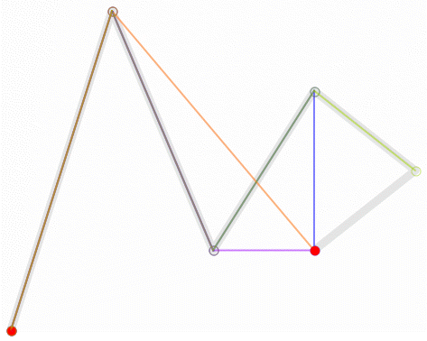
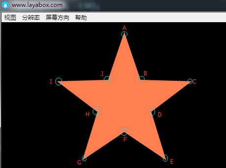
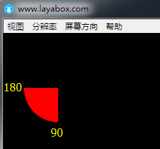
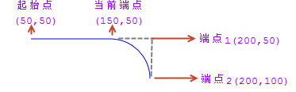
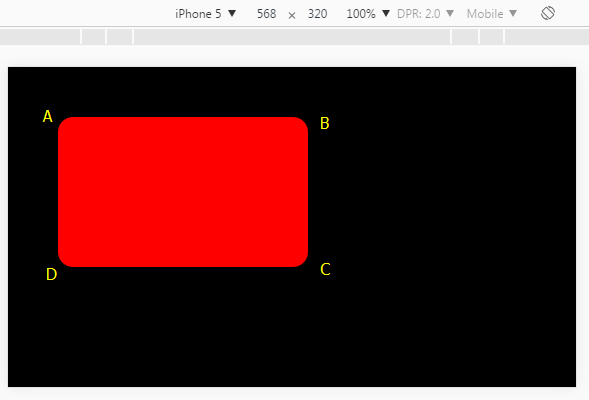

# 🔙​[Laya](/docs/laya/)

## 环境搭建

- npm install

- 编译库 npm run build

- 编译 npm run compile 复制 shader 文件到 bin/tsc/ 生成 bin/tsc indexTSC.html 中使用

- 本地文档 npm run buildDoc 纯粹 api 文档 价值不大 因为有.d.ts 文件

- 案例 cd src/samples & rollup -c 生成：bin/rollUp/bundle.js indexRollUp.html 中使用

    官方的方案会报错： 正确使用 rollup --config rollup.config.js --bundleConfigAsCjs
	```
    [!] RollupError: Node tried to load your configuration file as CommonJS even though it is likely an ES module. To resolve this, change the extension of your configuration to ".mjs", set "type": "module" in your package.json file or pass the "--bundleConfigAsCjs" flag.
	```
    

- 运行工具 tsc 依赖 bin 为根目录 
    - npm i lite-server live-server anywhere -D 不支持 
    - 需要全局安装方式 npm install -g live-server anywhere lite-server 
    - anywhere  
        用法：anywere 9100 同时开 http 和 https 很奇怪 这个目录运行不起来 
        
    - lite-server 基于 BrowserSync 可配置 更灵活 支持 https --help
        用法：live-server --port=9110 --baseDir ./ 
        
    - live-server [path] [options] 没找到--help live-server 基于 nodejs 更简洁 
        用法：live-server ./ --port=9110 
        --watch 监视改变
        --no-browser 不打开网页
    
- 启动webserver
  - lite-server ./bin/ --port=9666 
  - live-server ./bin/ --port=9668 
  - cd bin && anywhere 9666 无效

- 运行 demo 
  - indexRollUp.html bundle 版案例 
  - indexTSC.html tsc 版案例  使用了es-module-shims.js 让浏览器也支持es6语法 直接import 而不用将散文件丢到html里
  - indexTSCTest.html 缺少 spine-core.js 无法运行


## 源码结构

- [官方结构文档](https://ldc2.layabox.com/doc/?nav=zh-ts-0-3-4)
- vs 中调试 -- 默认配置了使用 gulp 运行 LayaAirBuild 功能 等同 npm run compile;以 tsc 的方式编译
- 编译引擎示例 src/samples & rollup -c
- 只编译引擎： 除了第一次需要完整运行上面两者(复制 shader 和案例) 后续只改了引擎可以通过 ctrl+shift+b 选择 tsc:构建-src/layaAir/tsconfig.json
- 提交修改给官方
    ```
        有一个自己的git库 可以是空的
        拉取远程库
         git remote add layaAir https://github.com/layabox/LayaAir.git
         git fetch layaAir
         git merge layaAir/master  合并某个分支到本地
    ```
    -- 推送本地提交 git push origin master -- 创建 request 给官方 中途会选取某个 commit

### 1. 源码主目录

```
bin 源码编译后的目录 有两种编译方式：tsc rollup
 都通过bin目录的anywhere运行
 tsc:vscode f5默认执行indexTSC.html;单文件编译，方便调试
 rollup:编译成一个js库; cd src/samples & rollup -c 可编译生成js库和示例库；
    首次时间比较久，需要几分钟；使用indexRollUp.html来运行，对应bin/rollUp/bundle.js

src 引擎 测试 插件
  buildtools 引擎团队内部测试时用的rollup插件工具
  casetest 内部自动测试工程
  extensions 插件源码 debugtool
  generateDoc 运行run.bat可生成api文档到doc目录
  layaAir 引擎源码
  publishTool as编译工具 发布引擎库和d.ts文件
  samples 测试用例 bin/demo下的源码来自此

package.json
  npm run build => publishTool/publish.bat
  npm run compile => tsc方式编译+copy shader files

src/layaAir
 ILaya.ts Laya.ts ILaya3D.ts ILaya3D.ts 主文件 所有模块都定义在这 为什么需要I文件？
 Config.ts Config3D.ts UIConfig.ts
 ani 像是spine转后的laya特制版本 性能高很多 但不支持最新、很多特性也不支持，导致兼容性问题
 components 脚本组件化支持 ui上使用？ 貌似支持的不是很好
 d3 3d独立大模块 -单独说明
 device 设备定位 加速器 视频播放 震动
 display 主渲染模块：scene sprite node stage cmd
 effect 显示特效：模糊 发光
 filters 过滤器：模糊 发光 区别？
 event 键盘 鼠标 事件系统
 html 解析器？
 layagl ？
 map tiled地图
 maths 数学库
 media 声音播放
 net 加载器 socket http 本地存储
 particle 2d粒子 怎么制作？ui编辑器？
 physics 物理
 renders 渲染结构？ rendersprite精灵
 resource 感觉命名有点问题 bitmap context texture texture2d
 system ?
 ui 控件
 utils handler byte log pool
 webgl 比较复杂：canvas shader submit text  3d的渲染不确定是否在内？
```

### 2. d3 部分

```
 animation 3d模型的动作？
 component 3d脚本组件？
 core 灯光 材质 例子 渲染 场景 拖尾
 graphic mesh渲染？
 loaders 模型加载？
 math 3d数学库
 physics 3d物理库
 resource ？
 shader
 shadowmap
 text 3d文字
 utils
```

### 3. 编译问题

- 编译 rollup libs 库 npm run build

```
    Error: Command failed: ..\..\node_modules\.bin\tsc.cmd -b ../layaAir/tsconfig.json
    ../../node_modules/@types/node/crypto.d.ts(3533,17): error TS1110: Type expected.
    ../../node_modules/@types/node/events.d.ts(98,28): error TS1005: ',' expected
    ../../node_modules/@types/node/test.d.ts(881,34): error TS1005: '?' expected
    --
    尝试1： 无效
    npm install @types/node@latest --save-dev
    "devDependencies": {
        "@types/node": "^20.11.30"
      },
    尝试2： 对比项目中的引擎源码环境是可以编译的 说明是库版本问题
    npm show @types/node version
    旧项目20.11.30 新项目竟然也是  为何对比文件内容并不相同？
    对比package-lock.json
    "@types/node": {
      "version": "13.13.4",   新库为 "version": "20.11.30",
    ---
    修改后 npm i 再编译就正常了
    package-lock.json 是 npm 5 之后新增的文件，用来确保在安装依赖时生成的依赖树是确定性的。
    上面的案例 里面写明了ts依赖node的版本  同样是laya2.5.0的库 为何文件内容会变？
```

- 编译 tsc 单文件库 npm run compile
- 编译案例 cd src/samples & rollup -c

---

## 文档

- [官方](https://ldc2.layabox.com/doc/?nav=zh-ts-0-3-0)
- [typescript](https://www.tslang.cn/docs/home.html)
- [demo](https://layaair2.ldc2.layabox.com/demo2/?language=en&category=2d&group=Sprite&name=DisplayImage)


### 1. 简介篇

#### 1.1 html5

- 最终规范：2014 年 10 月 29 日

#### 1.2 小游戏

不是 h5，只是兼容了大部分 Canvas 和 Webgl 接口，不能在浏览器中运行。  
比如微信，需要在微信 app 的 runtime 中运行。

#### 1.3 laya 引擎

- 引擎库+ide+u3d 插件
- layanative：以 layaplayer 为核心，不局限 laya 引擎(？怎么适配)，利用反射机制实现原生和 js 互通
    - 支持双线程，操作相应慢 1 帧，性能更好
    - 支持 chrome 调试 js，不再只靠 console.log 或 alert 了

### 2. 基础篇

#### 2.1 环境安装

- nodejs.org 下载 lts 目前在用 v14.21.3
- typescript npm i -g 当前 5.0.4
- npm 缓存冲突 npm cache clean --force

#### 2.2 LayaAirIDE

项目的创建、编译、发布

#### 2.3 源码示例编译和运行

- git clone https://github.com/layabox/LayaAir.git
- npm install
- 源码目录：src/samples/
- 资源目录: bin/res
- 编译：vscode ctrl+shift+b 选择 gulp:LayaAirBuild 或 f5
- 进入 bin 目录 启动 web 服务器 参考前面 打开 indexTSC.html
- 切换 3d/2d 示例 默认为 3d
    - 修改 index.ts new Main(use3D) 入参
    - 新版本改为 window["isType"] = false; 但是初始化有 bug
    - this.\_isType = (window as any).isType || true; 始终为 true
- 自定义 demo 修改 index.ts import 后直接 new

#### 2.4 引擎使用基础

- 2.4.1 画布 canvas
    - 像画纸 每一帧显示的容器
    - 初始大小 config.json 中设置 ide 默认 640x1136 屏幕适配看后续
- 2.4.2 舞台 stage 实际做画区域 能显示的大小 实际边缘图片或 spine 可能会超出
- 2.4.3 节点 显示列表 显示对象
    - node 可放在显示列表中的基类 sprite sprite3d 继承与它
    - node 的子类都属于显示对象 无论是否可渲染 比如音频节点
    - 显示列表：抽象节点树 注意：只有 node 和 sprite 的子类才可添加到 stage； sprite3d 只能添加到 3d 场景

#### 2.5 文本

##### 2.5.1 laya.display.Text 样式 样式 大小

    - 一些基本属性 [详细属性](https://layaair2.ldc2.layabox.com/api2/Chinese/index.html?version=2.9.0beta&type=Core&category=display&class=laya.display.Text)
    - aligin 水平对齐 left center right
    - valign 垂直对齐 top middle bottom
    - bgColor 文本背景色 矩形框  默认透明？
    - bold 粗体
    - borderColor 边框色 不是字体边缘 是矩形框  方便查看文本具体位置和换行是否正确
    - color 本身颜色
    - font 默认Arial  Text.defaultFont 可修改
    - fontSize 默认20 Text.defaultSize
    - width height 显示对象的高度 用途？ 为了上下居中？
    - HIDDEN  不显示超出文本框的字符
    - italic 斜体 可能导致文字超出矩形框范围
    - langPacks Object 语言包
    - leading 垂直间距 多行需要
    - lines Array 只读 解析后的内容
    - maxScrollX 只读 横向可滚动值
    - maxScrollY
    - wordWrap 自动换行 默认false
    
    - 超出文本区域
    - overflow 性能从高到低 hidden visible scroll
    - scroll方式 可通过监听鼠标移到 通过scrollX Y来控制内容滑动 为什么自己不支持 不想和鼠标模块关联？

##### 2.5.2 输入框 input 单行和多行 laya.ui.textInput

- 基础属性
    - editable 可编辑
    - focus 焦点命中 可输入？
    - width height 当 0 时 自适应大小 根据字体大小？ .size(w,h)
    - inputElementXAdjuster 原生输入框 x 的偏移
    - maxChars 默认 10000 基于 utf8 的长度？
    - multiline 多行输入 需要配合 wordWrap
    - prompt 提示符
    - promptColor 一般为浅色
    - restrict 限制输入的字符 怎么用？
    - sizeGrid 背景图网格数据 上右下左的边距 0:不重复 1:重复填充 "4,4,4,4,1" 没看懂？
    - skin 皮肤-背景图
    - type text password number 后续是否支持？：submit radio checkbox button date ... [标准输入类型](https://www.w3school.com.cn/html/html_form_input_types.asp)
    - padding 边距 可控制空白距离 和底图好适配 [2, 2, 2, 2];

##### 2.5.3 位图字体的制作与使用

- 如何通过 Bitmap Font Generator 来制作位图字体

    - [text](https://layaair2.ldc2.layabox.com/api2/Chinese/index.html?type=Core&category=display&class=laya.display.Text)
    - [BitmapFont](https://layaair2.ldc2.layabox.com/api2/Chinese/index.html?type=Core&category=display&class=laya.display.BitmapFont)

    - 下载[工具](http://www.angelcode.com/products/bmfont/) 支持字体库或美术设计图两种方式

##### 2.5.4 字体库方式

- 制作流程
    - 将需要的文件记录在一个 txt 中 可中文 "测试文字 1234567890abcdefghijklmnopqrstuvwxyz"
    - 编码改为 unicode(UTF-16 LE) notepad2 有 unicode 不确定是否一致？
    - 字体设置 option ： font settings
        - font 系统安装的字体
        - charset 必须使用 unicode 有看到 ansi 的 不能用？
        - size 字体大小
        - height 拉伸高度 默认 100% 用途？
    - 导入 txt edit：select chars form file 如果失败 可能是格式问题或字体库不支持-比如中文
    - 导出选项 options：export options
        - bit depth 必选 32 位 否则没透明层 默认 8
        - presets 初始样式 白字透明底 white text with alpha-白字没边 默认的 custum 什么效果？-白字灰边
        - width height 导出图大小 若不够会怎样？-导出报错 不生成 png
        - font descriptor 字体描述文件 laya 必须选 xml 默认 text
        - textures 纹理格式 必须选 png 默认 tga
    - 效果预览 options： visualize
    - 导出 options ： save bitmap font as...
        - 起一个字体名 xxx.fnt + xxx_0.png
        - fnt: 字体 大小 纹理 每个字符的位置信息
        - <char id="48" x="0" y="30" width="14" height="22" xoffset="1" yoffset="6" xadvance="16" page="0" chnl="15" />

##### 2.5.5 图片字方式

- 制作流程
    - 准备单张散图 大小是否需要一样？（不需要）
    - 制作字体 edit：open image manager :image 菜单：import image 注意：图片字估计大小有限制 74x74 加载不了 每选中一张图片 都需要配置 id 这个值是字体库中的真实值 识别 id 的方案：用上面的方法 搞一个 txt 导入 右边列表中有命中的字体 会有选中标识 切到那页后 可看到具体文字的编码 - 鼠标放到文字下 右下角 233390:5B5E 前面部分就是 id
    - 后续导出步骤同上 注意:若为了 id 导入的 txt 需要清理掉 不然会一起导出 edit: clear all chars in font
    - laya 不支持多张图片 需要将 fnt 和 png 的名称改为一致(它没去读 fnt 内的图片名)
    - 标点 可选大小不一的图片 让，占用更小的范围 比起 fontclip 好看很多
    - 空格： 可直接选中目标 常规第一页的内容 都可直接选中 若用系统字体库的画
    - <char id="46" x="0" y="0" width="26" height="26" xoffset="0" yoffset="0" xadvance="26" page="0" chnl="15" />

##### 2.5.6 laya 中图片字的使用

- laya 中使用图片字

```typescript
    loadBitmapFont(): void {
        let bitmapFont: Laya.BitmapFont = new Laya.BitmapFont();
        bitmapFont.loadFont("res/vvv.fnt", new Laya.Handler(this, this.onFontLoaded, [bitmapFont]));

    onFontLoaded(bitmapFont: Laya.BitmapFont): void {
        //如果采用系统字生成的位图字体，可以在这里控制空格的宽度,如果系统字里带有空格，也没必要设置了
        // bitmapFont.setSpaceWidth(10);
        Laya.Text.registerBitmapFont(this.fontName, bitmapFont); //注册位图字体
        this.createText(this.fontName);
    createText(font: string): void {
        var txt: Laya.Text = new Laya.Text();
        //设置每行的显示宽度
        txt.width = 260;
        //开启自动换行
        txt.wordWrap = true;
        txt.text = "鼠牛虎兔龙蛇马羊猴鸡狗 猪年快乐";
        //使用注册后的字体
        txt.font = font;
        txt.leading = 15;
        //把文本添加到场景中的bf节点下
        this.bf.addChild(txt);
    }
```

##### 2.5.7 ide 里使用位图字体排版

    - fnt+png复制到assets目录 点击菜单文件：刷新编辑器
    - 创建text label texinput控件 font属性可改为刚才的fnt字体名  如果文字内容不在字库中会怎样？
    - 代码中再次注册字体

```typescript
    this.loadBFont("bitmapFont/ccc.fnt", this.fontName);

    loadBFont(fntPath: string, fontName: string): void {
        let _bitmapFont: Laya.BitmapFont = new Laya.BitmapFont();
        _bitmapFont.loadFont(fntPath, new Laya.Handler(this, (bitmapFont: Laya.BitmapFont) => {
            //按传入名称注册不同名称的位图字体
            Laya.Text.registerBitmapFont(fontName, bitmapFont);
        }, [_bitmapFont]));
    }
```

- 注意事项
    - 小游戏：由于 fnt 基于 xml 解析 但是小游戏环境默认不支持 需要 domparserinnone.js 库

##### 2.5.8 laya 中的所有文件组件

- 常规文本 html 文本 位图文本 可输入文本
- 常规文本：text filltext label
    - 渲染机制：两种 text 文本统一提交 和 graphics 的 filltext 单字符绘制提交
        - text 统一方式：先形成小图集 在提交到大图集中 若某个文字发生变化 整块都要重新提交 若文字频繁改变 大图集会不断被填充 满后创建新的大图集 等条件 gc 这个过程内存会一直涨 情况 gc 时可能卡顿
        - graphics 的 filltext 方式：按单个字符向大图集提交 重复利用率更高 但性能更差
        - 所以两种使用场景有区别
    - 静态文本和动态文本： 看内容是否改变
        - Text 和 Label 都属于处理静态文本的类
            - Text 是最基础的文本组件，他直接继承于 Sprite，而 Label 继承于 UIComponent 再往上才是 Sprite
            - label 支持布局适配
            - 看 2.5.0 的字体渲染 初始 text="xxx" 用的动态渲染 changetext 后变成静态渲染 优化：用一个开关来控制
        - fillText、fillBorderText、strokeText 等，都是 Graphics 类中用于单字符提交的文本绘制方法
            - FillText 文本由于是引擎自己绘制的，目前只适用于中英文等主流国家语言
            - 对于泰国语、阿拉伯语等复杂的语言，显示可能会有异常 估计是排版计算大小有问题
    - 字体设置区别：
        - lable 的 font 指系统字体 Microsoft YaHei 还是 Arial
        - fillText 的 font 指 canvas2d 渲染时 css 的字体 bold 60px simHei italic
- 位图文本

    - fontclip 以 sheet 内容"0123456789"平均切割图片 value 控制显示的内容
        - 如果有多行 可用空格来分割 sheet 内容 但保证等宽
        - 不支持空格 因为是等宽的 空格相当于空了一个字符
    - bitmapfont

        - 通过 Bitmap Font Generator 工具导出位图字体 可控制空白字大小

    - html 文本组件
        - HTMLDivElement 通常用于聊天 采用单字符提交图集 采用系统字 支持常见的 html 标签
        - 支持的 html 标签
        ```
            div 一般通过style控制内部格式
            span 行内某个元素
            h1 h6 标题
            p 段落  会自动换行
            br 换行  <br />
            &nbsp; 空格 注意后面有个分号
            style 样式标签 <div style='width:880px;height:100px;font-family:SimSun;'><span style='font-weight:bold;font-size:70px;'>HTML文本</span></div>
            img </img>
            color 文本颜色 和style类似 <span color='#e3d26a'>颜色</span>
        ```
        - 支持的 style
        ```
            italic:true|false
            bold:true|false
            letter-spacing:10px 字间距
            font-family:宋体;YaHei;  字体集 按顺序优先读取
            font-size:20px
            font-weight:bold; 同单独的bold
            color：#ff0000
            stroke:2px 描边宽度
            strokeColor:#ff0000
            padding:10px 10px 20px 20px; 边距 上右下左
            line-height:100px; 行高
            align:left|right|cent
            backgrond-color:#ff0000; div中
            border-color:#ff0000; 边框颜色 div中
            width:100px div中
            height:100px div中
        ```

##### 2.5.9 可输入文本组件

- TextInput TextArea

##### 2.5.10 文本性能优化

- 静态文本 Text Lable 若单行 除了文字 大小、颜色、粗细、斜体、对齐等都不改变 用 changeText 来修改 会跳过排版 直接修改绘制指令
- 对于静态文本 节点比较多时 可开启 casheAs 设置 normal 可优化节点数(怎么实现的？) 设置 bitmap 可优化 drawcall
- 文本内容频繁改变：优先 filltext 或 位图文本
- 少用文本描边：多调用一次绘图指令 不是有图集缓存吗？
- 被文本打断的 drawcall：
    - ide 中将文本放一起
    - 所有文本的‘父级节点’drawCallOptimize 属性设置 true 值 引擎会自动启用文本合并优化 将所有的文本提取到最上层
        - 需要文字内容不被遮挡
        - 不是它自己的属性 而是父节点？

#### 2.6 位图

##### 2.6.1 显示与切换图片

图片是游戏的基础 游戏中有两种方式：Sprite.loadImage Graphics.drawTexture

- loadImage 显示与切换图片
    可以直接用url 或等加载完 从缓存中获取texture
    - api loadImage(url, complete:Handler): Sprite
        - 加载图片后 设置 texture 属性
    - 加载和显示示例

    ```typescript
      let spr = new Sprite()
      spr.pos(10,10)
      Laya.stage.addChild(spr)
      spr.loadImage("../xx.png")
    ```

    - 切换图片

    ```typescript
      调用两次即可 也可以先加载 再调用 次数可获取texture和size
      Laya.loader.load([this.texture1, this.texture2], Handler.create(this, this.onAssetsLoaded));
      var texture: Texture = Laya.loader.getRes(textureUrl);
      this.ape.loadImage(textureUrl);
      this.ape.size(texture.width, texture.height);
    ```

- drawTexture 显示与切换图片
    - api
      - drawTexture(tex:Texture, x=0, y=0, w=0, h=0, matrix=null, alpha=1, color=null, blendMode=null):DrawTextureCmd
        - 功能更强大 但性能差些
        - 参数解释：
            - matrix 做什么用？
            - color 滤镜
            - blendMode 混合模式

      - load(url, complete, progress, type, priority, cache, group, ignoreCache):LoaderManager
        - url可以是单独文件或数组
        - group 分组何用？
        - ignoreCache 强制重新加载 默认false
      - getRes(url) 得到资源

    - 加载案例: 必须等资源加载完后才能使用 
    ```typescript
        Laya.loader.load("../../res/apes/monkey2.png", Handler.create(this, function(): void {
            var t: Texture = Laya.loader.getRes("../../res/apes/monkey2.png");
            var ape: Sprite = new Sprite();
            ape.graphics.drawTexture(t, 0, 0);
            Laya.stage.addChild(ape);
            ape.pos(100, 50);
        }));
    ```

    - 切换图片：清空后重新绘制 同样需要先预加载
    ```typescript
        this.ape.graphics.clear();
        var texture: Texture = Laya.loader.getRes(textureUrl);
        this.ape.graphics.drawTexture(texture, 0, 0);
    ```

##### 2.6.2 遮罩
- 可以设置一个对象-`位图`或`矢量图`
- 遮罩api 属于laya.display.Sprite
    - mask属性 = Sprite 注意：坐标系相对遮罩对象本身？
- 遮罩案例
```javascript
    Laya.loader.load(this.Res,Laya.Handler.create(this,this.graphicsImg));
    this.img.graphics.drawTexture(Laya.loader.getRes(this.Res),150,50);
    
    this.cMask = new Laya.Sprite();
    //画一个圆形的遮罩区域
    this.cMask.graphics.drawCircle(80,80,50,"#ff0000");
    //圆形所在的位置坐标
    this.cMask.pos(120,50);  基于父精灵的左上角？
    //实现img显示对象的遮罩效果
    this.img.mask = this.cMask;
```

- ide中设置遮罩
    - 方式1：图片遮罩
        - 原sprite中拖入遮罩图片 作为子节点 设置renderType为mask
    - 方式2：矢量图
        - 新建sprite子对象 同样需要设置rendertype
        - bases/graphics/中选择图形类型 circle pie rect 或 右键菜单：创建graphics
        - 双击空白区域 退出选中状态 就可以看到遮罩后的效果


##### 2.6.3 设置滤镜
引擎提供颜色 发光 阴影 模糊
- 颜色滤镜 laya.filters.ColorFilter
    - 需要一个颜色矩阵4x5 怎么计算的？
    - 前四列分别表示红色、绿色、蓝色和透明度，第五列表示颜色偏差值 可以让你调整图像的亮度或者对比度
    ```
        R  R  R  0  0
        G  G  G  0  0
        B  B  B  0  0
        A  A  A  1  0
        //颜色滤镜矩阵，红色
        var colorMatrix:any = 
          [
          1, 0, 0, 0, 0, //R
          0, 0, 0, 0, 0, //G
          0, 0, 0, 0, 0, //B
          0, 0, 0, 1, 0, //A
        ];
        //创建红色颜色滤镜
        var redFilter:Laya.ColorFilter = new Laya.ColorFilter(colorMatrix);
        
        //由 20 个项目（排列成 4 x 5 矩阵）组成的数组，灰图
        var grayscaleMat: Array<number> = 
        [0.3086, 0.6094, 0.0820, 0, 0, 
         0.3086, 0.6094, 0.0820, 0, 0, 
         0.3086, 0.6094, 0.0820, 0, 0, 
         0, 0, 0, 1, 0];
        
        spr.filters = [redFilter];
    ```

- 发光滤镜 laya.filters.GlowFilter 可当成阴影滤镜使用
    - GlowFilter(color:string, blur=4, offX=6, offY=6)
    ```
        //发光滤镜
        var glowFilter: GlowFilter = new GlowFilter("#ffff00", 10, 0, 0);
        //阴影滤镜
        var shadowFilter: GlowFilter = new GlowFilter("#000000", 8, 8, 8);
    ```

- 模糊滤镜 laya.filters.BlurFilter
    - BlurFilter(strength=4)
    ```
        var blurFilter: BlurFilter = new BlurFilter();
        blurFilter.strength = 5;
    ```

#### 2.7 矢量图
通过laya.display.Graphic绘制各种矢量图形 像是对canvas2d的封装

##### 2.7.1 直线和折线
- 直线 drawLine(fromx, fromy, tox, toy, lineColor:String, lineWidth=1)
```typescript
    this.sp.graphics.drawLine(10, 58, 146, 58, "#ff0000", 3);
```

- 折线 drawLines(x, y, points:Array, lineColor, lineWidth=1)
    - points:[] 点集合 [x1,y1,x2,y2,...]  相对起点x y
```
    this.sp.graphics.drawLines(20, 88, [0, 0, 39, -50, 78, 0, 120, -50], "#ff0000", 3);
```

##### 2.7.2 ide中绘制直线
Basics/Graphics/Line 拖入到view中


##### 2.7.3 绘制曲线
- 贝塞尔曲线：起点 终点 中间控制点 

- 一次贝塞尔 是一条直线 1个控制点 沿着头尾移动 
- 二次贝塞尔 曲线 2个控制点 第一个沿着第一段 第二个沿着第二段 
- 三次贝塞尔 曲线 曲度更大 3个控制点形成2条线 再降维到2个控制点 后续同上 不同的是控制线也会移动 
- 高阶贝塞尔 曲线控制力度更大 可随意不同方向弯曲 
    - 核心思路不变：多点形成的多条轴 -> 每条轴都有一个动点随着时间百分比从一端到另一端 -> 若大于2条会降维度  
        -> 直到变成二次曲线为止 
         

- laya中绘制曲线-采用2 3次贝塞尔曲线
    - laya.display.Graphics.drawCurves()
    - drawCurves(x, y, points:Array, lineColor, linewidth=1)
        - points 3个控制点 包含起始和终点
    ```javascript
        this.sp.graphics.drawCurves(10, 58, [0, 0, 19, -100, 39, 0], "#ff0000", 3); 2次
        this.sp.graphics.drawCurves(10, 58, [0, 0, 19, -100, 39, 0, 58, 100, 78, 0], "#ff0000", 3); 3次
    ```

- ide中绘制曲线
    - Basics:Graphics:Curves


##### 2.7.4 绘制三角形、多边形以及自定义图案
- 封闭的区域 顺时针的点布局 是否支持凹多边形？-支持  
    - 注意：本质还是三角形 只有顺时针方向会渲染 逆时针不可见 估计默认设置的单面渲染
    - laya.display.Grahpics.drawpoly(x, y, points, fillColor, lineColor, lineWidth=1)
    
    ```javascript
    //画三角形  3个相对点
    this.sp.graphics.drawPoly(30, 28, [0, 100, 50, 0, 100, 100], "#ffff00");
    
    //画多边形 
    this.sp.graphics.drawPoly(30, 28, [0, 100, 50, 0, 100, 100, 75, 150, 25, 150], "#ffff00");
    
    var path: Array<number> = [];
    path.push(0, -130);//五角星A点坐标
    path.push(33, -33);//五角星B点坐标
    path.push(137, -30);//五角星C点坐标
    path.push(55, 32);//五角星D点坐标
    path.push(85, 130);//五角星E点坐标
    path.push(0, 73);//五角星F点坐标
    path.push(-85, 130);//五角星G点坐标
    path.push(-55, 32);//五角星H点坐标
    path.push(-137, -30);//五角星I点坐标
    path.push(-33, -33);//五角星J点坐标
    canvas.graphics.drawPoly(Laya.stage.width / 2, Laya.stage.height / 2, path, "#FF7F50");
    ```
    


- ide中画多边形
    - Basics:Graphics:Poly


##### 2.7.5 绘制圆形与扇形
- laya.display.Grahpics.drawCircle(x, y, radius, fillColor, lineColor=null, lineWidth=1)
```js
this.sp.graphics.drawCircle(80,80,50,"#ff0000");
```

- drawPie(x, y, radius, startAngle, endAngle, fillColor, lineColor=null, lineWidth=1)
```js
this.sp.graphics.drawPie(80,80,50,90,180,"#ff0000");
```



- ide中绘制圆形/扇形
    - Basics:Graphics:Circle / Pie


##### 2.7.6 绘制矩形和圆角矩形
- laya.display.Grahpics.drawRect(x, y, width, height, fillColor, lineColor, lineWidth)
```
this.sp.graphics.drawRect(20, 20, 100, 50, "#ffff00");
```

- drawPath(x, y, paths, brush:Object=null, pen:Object=null)
    - paths:[["moveTo",x,y], ["lineTo",x,y,x,y,x,y], ["arcTo", x1,y1,x2,y2,r]] 路径集合
    ```
    var path:Array<any> =  [
        ["moveTo", 0, 0], //画笔移到A点
        ["lineTo", 100, 0],//画到B点
        ["lineTo", 100, 50],//再画到C点
        ["lineTo", 0, 50], //继续画到D点
        ["closePath"] //闭合路径  若无图像不会闭合-针对有边框的情况
    ];
     //绘制矩形  比drawRect麻烦一些 主要为了学习参数控制
    this.sp.graphics.drawPath(20, 20, path, {fillStyle: "#ff0000"});
    ```

    - 绘制圆角矩形
    ```
    ["moveTo", 50, 50],
    ["lineTo", 150, 50],
    ["arcTo", 200, 50, 200, 100, 50],  3个点+半径 决定一个弧度 必须要直角？
    ```
    
    ```
        var path:any[] =  [
                ["moveTo", 0, 0], //画笔的起始点，  这里有bug 若画线框会多出一截 ["moveTo", 30, 0], //画笔的起始点，
                ["lineTo",400,0],
                ["arcTo", 500, 0, 500, 30, 30], //p1（500,0）为夹角B，（500,30）为端点p2
                ["lineTo",500,200],
                ["arcTo", 500, 300, 470, 300, 30],//p1（500,300）为夹角C，（470,300）为端点p2
                ["lineTo",30,300],
                ["arcTo", 0, 300, 0, 270, 30], //p1(0,300)为夹角D，（0,270）为端点p2
                ["lineTo",0,100],
                ["arcTo", 0, 0, 30, 0, 30],//p1(0,0)为夹角A，（30,0）为端点p2
            ];
        //绘制圆角矩形
        this.sp.graphics.drawPath(100, 100, path, {fillStyle: "#00ffff"});
        //包含线框
        this.sp.graphics.drawPath(100, 100, path, {fillStyle: "#ff0000"},{"strokeStyle":"#ffffff","lineWidth":"10"});
    ```
    

- ide画矩形
    - Basics:Graphics:Rect


##### 2.7.7 消除矢量图绘制锯齿
pc上比较明显 手机由于像素密度大 效果会好一些
- 开启锯齿消除设置
```
    Laya.Config.isAntialias=true;  需要在init之前 因为参数是传给canvas webgl的？
    Laya.init()
```


#### 2.8 动画基础
Animation类可使用多种动画资源 
[api-AnimationBase](https://layaair2.ldc2.layabox.com/api2/Chinese/index.html?version=2.9.0beta&type=Core&category=display&class=laya.display.AnimationBase)
[api-Animation](https://layaair2.ldc2.layabox.com/api2/Chinese/index.html?version=2.9.0beta&type=Core&category=display&class=laya.display.Animation)


##### 2.8.1 图集动画
用ide创建时间轴动画.ani 图集打包后为.atlas
- 命名规则：动作名+帧序列号 walk0.png walk1.png
- 加载动画资源
    - Animation.loadAtlas(url, loaded:Handler, cacheName)
    - cacheName缓存动画模板名 可在play(start, loop, name)中使用
    ```
        this.roleAni = new Laya.Animation();
        //加载动画图集，加载成功后执行回调方法
        this.roleAni.loadAtlas("res/atlas/role.atlas",Laya.Handler.create(this,this.onLoaded));
        默认不会播放 显示第一张图？
        this.roleAni.play(); 一直循环播放
    ```
- play(start, loop, name) 整个从某帧开始播放

- 通过createFrames(url, name)创建动画模板：为了区分多个不同的动作在同一个集合中
    - 适合动作较少 全部打成一个图集 提高性能
    - url为单个 或 数组
    ```js
        Laya.Animation.createFrames(this.aniUrls("die",6),"dizziness");
        //循环播放动画
        this.roleAni.play(0,true,"dizziness");
        
        private aniUrls(aniName:string,length:number):any{
            var urls:any = [];
            for(var i:number = 0;i<length;i++){
                //动画资源路径要和动画图集打包前的资源命名对应起来
                urls.push("role/"+aniName+i+".png");
            }
            return urls;
        }
    }
    ```

- 使用loadImages直接播放动画
    - loadImages(urls, cacheName): Animation
    ```
        this.roleAni.loadImages(this.aniUrls("move",6)).play();
    ```
    - loadImage方法也可以创建动画模板
        - 被多次使用的时候，使用动画模板可以节省CPU的开销
        - 偶尔或一次使用，那就不要使用动画模板，因为节省CPU开销是以牺牲一定的内存开销为代价
        - 怎么释放缓存?
    ```
        roleAni.loadImages(aniUrls("move",6),"walk").play();
    ```

- ide
    - Animation组件  怎么用？


##### 2.8.2 缓动动画
Tween+Ease 实现各种动画效果 
[demo](https://layaair2.ldc2.layabox.com/demo2/?language=zh&category=2d&group=Tween&name=EaseFunctionsDemo)

- api
    - from(target, props, duration, ease=null, complete=null, delay=0, coverBefore=false, autoRecover=true)
    - to 同上
    - props：位置 alpha 轴心 大小
    - ease: 缓动类型 [案例](https://layaair2.ldc2.layabox.com/demo2/?language=zh&category=2d&group=Tween&name=EaseFunctionsDemo)
    - 注意：通过ease的控制 实际属性范围会超出属性目标值 因为有弹性缓冲功能

- 缓动动画事件控制
```
    compelte
    props中加update 每帧调用
    Laya.Tween.to(letterText, { y : 300, update: new Laya.Handler(this, this.updateColor,[letterText])}, 1000, Laya.Ease.bounceIn, Laya.Handler.create(this,this.changeColor,[letterText]), i * 100);
```


##### 2.8.3 时间轴动画

- 有两种模式:通用的ani独立文件，可用于不同ui + ui内编辑的动画


---

## 官方案例

---

## 核心模块

---

## 设计模式

## 项目实践

## 参考资料

## 复刻

### 核心模块

### 主框架

## 心得体悟
