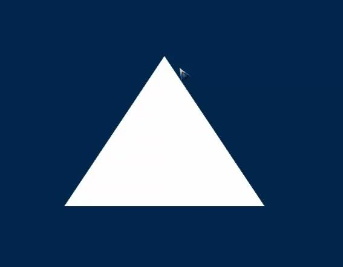

# 🔙[OpenGL](/docs/opengl/)


## 网格
可以理解为一个个三角形组成的一个网状物


### 需要的元素：
1. 顶点数据 + 纹理数据
2. 对上面数据的封装：比如三角形需要3个a中的数据


### 顶点封装类 Vertex
只包含了数据
```
	glm::vec3 pos;
	glm::vec2 texCoord;
```

### 网格封装类 Mesh
通过一个顶点数组指针和数量来构造  
提供Draw渲染接口  
内部封装了vao、vbo用于渲染  
```
	Mesh(Vertex* vertices, unsigned int numVertices);
    void Draw();

    GLuint _vertexArrayObject;
    GLuint _vectexArrayBuffers[NUM_BUFFERS];
    unsigned int _drawCount;
```


### VAO对象的封装 以及VBO的创建
```
  申请vao对象 并绑定 之后的所有vbo的操作都和它相关
    glGenVertexArrays(1, &_vertexArrayObject);
    glBindVertexArray(_vertexArrayObject);

  申请vbo 可能由多个：顶点 纹理 颜色
    glGenBuffers(NUM_BUFFERS, _vectexArrayBuffers);

  绑定一个vbo 比如顶点vbo   并为之指定数据来源、数量及渲染方式
    glBindBuffer(GL_ARRAY_BUFFER, _vectexArrayBuffers[POSITION_VB]);
    glBufferData(GL_ARRAY_BUFFER, numVertices * sizeof(positions[0]),
            &positions[0], GL_STATIC_DRAW);

  用顶点属性数组  并为之前指定的数据提供解析  
  不知数据是否在这个阶段传给opengl服务器  还是在draw的时候？
    glEnableVertexAttribArray(0);
    glVertexAttribPointer(0, 3, GL_FLOAT, GL_FALSE, 0, 0);
    参数说明：顶点索引0   该顶点包含3个  float类型的数据  不需要归一化
             两个顶点数据之间偏移量为0   
             数据指针：若为0 表示从vbo中获取  若没用vbo 也可以直接指向数据源
             cocos2.2.6中的sprite就没用vbo

  绑定纹理坐标vbo  过程和顶点类似
    glBindBuffer(GL_ARRAY_BUFFER, _vectexArrayBuffers[TEXCOORD_VB]);
    glBufferData(GL_ARRAY_BUFFER, numVertices * sizeof(texCoords[0]),
            &texCoords[0], GL_STATIC_DRAW);
    glEnableVertexAttribArray(1);
    glVertexAttribPointer(1, 2, GL_FLOAT, GL_FALSE, 0, 0);

  解除vao的绑定  也表示之前的所有内容都属于该vao
    glBindVertexArray(0);
```

### vao的删除
一般在渲染对象析构中   即：这个对象不再用了  
所以只要对象还存在   数据就一直在vbo中   不知这部分内存opengl是怎么管理的？  
有说在内存里  也有说显存中  待研究！  
```
	glDeleteVertexArrays(1, &_vertexArrayObject);
```

### 使用vao渲染
比较简单 ：绑定 draw 解绑  
所以vao就是为了简化vbo的使用而创建的一种形式  

若不用vao 直接用vbo渲染  
则 之前初始化时 绑定vbo并指派数据和解析方式的代码 就要放到draw里  
```
	glBindVertexArray(_vertexArrayObject);
    glDrawArrays(GL_TRIANGLES, 0, _drawCount);
    glBindVertexArray(0);
```


### Main中对Mesh对象的使用
```
	Vertex vertices[] = {
        Vertex(glm::vec3(-0.5, -0.5, 0), glm::vec2(0, 0)), 
        Vertex(glm::vec3(0, 0.5, 0), glm::vec2(0.5, 1.0)),
        Vertex(glm::vec3(0.5, -0.5, 0), glm::vec2(1.0, 0)),
    };

    Mesh mesh(vertices, sizeof(vertices)/sizeof(vertices[0]));

    ...
    mesh.Draw();
```
定义顶点数组数据  传给Mesh的构造  
渲染时直接通过mesh.Draw   
间接调用了glDrawArrays(GL_TRIANGLES, 0, _drawCount);  
注意：顶点数组中三角形顶点的顺序是有要求的  
当超过3个时  怎么排序 有待验证！估计和传入的方式GL_TRIANGLES也有关系  

若没设置过投影  默认范围[-1,1]  所以-0.5 0.5正好时1/4处


## 踩坑记录
1. 无论怎么传数据 三角形位置始终不对
```
	原因a：
    glBufferData(GL_ARRAY_BUFFER, count * 4), &vertices[0], GL_STATIC_DRAW); 
    --》
    glBufferData(GL_ARRAY_BUFFER, count * sizeof(vertices[0]), &vertices[0], GL_STATIC_DRAW); 

    Vertex 内部存放了一个 glm::vec3 pos;   所以sizeof 应该是3个float = 12字节 

    原因b:
    class Vertex
    {
    public:
        Vertex(const glm::vec3& pos)
        {
            this->pos = pos;
        }
        virual ~Vertex() {}

    private:
        glm::vec3 pos;
    };
    由于加了虚析构  导致类多了一个虚拟表的指针  
    sizeof(vertices[0]) == sizeof(Vertex) = 16   而非12  
    表现上比较奇特   相当于(?,x,y,z)  多出的4字节空位 顶替了x的值  
    解决：删除~Vertex即可
```


