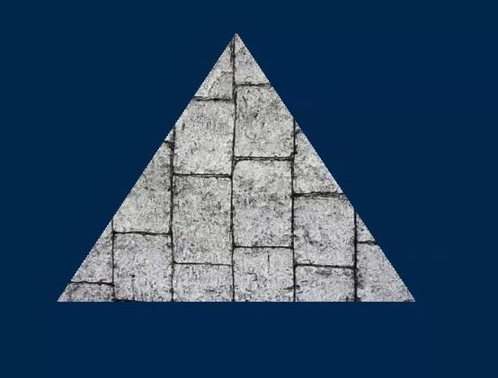

# 🔙[OpenGL](/docs/opengl/)

## 纹理


## 图片的加载

这里用了stb库  
https://github.com/nothings/stb  
只需要stb_image.h .c  
cocos中 使用了png jpg的库 自己来封装  


## 纹理对象的创建
```
	读取图片  获取宽 高
    int width, height, numComponents;
    unsigned char* data = stbi_load(fileName.c_str(), &width, &height, &numComponents, 4);

    申请纹理对象 并绑定
    glGenTextures(1, &_texture);
    glBindTexture(GL_TEXTURE_2D, _texture);

    设置纹理的S T信息 操作纹理坐标时 怎么采用纹理数据
    glTexParameteri(GL_TEXTURE_2D, GL_TEXTURE_WRAP_S, GL_REPEAT);
    glTexParameteri(GL_TEXTURE_2D, GL_TEXTURE_WRAP_T, GL_REPEAT);
    放大和缩小 采用的线性过滤方式
    glTexParameterf(GL_TEXTURE_2D, GL_TEXTURE_MIN_FILTER, GL_LINEAR);
    glTexParameterf(GL_TEXTURE_2D, GL_TEXTURE_MAG_FILTER, GL_LINEAR);
    传输纹理数据给opengl 具说格式会转为其他方式 且保存在内存中 而非gpu 什么时候传呢？
    glTexImage2D(GL_TEXTURE_2D, 0, GL_RGBA, width, height, 0, 
        GL_RGBA, GL_UNSIGNED_BYTE, data);
    传输后 原始图片数据就可以删除了  所以纹理内存会放大2倍 又立刻还原
    jpg由于要想解析为rgba格式  所以会放大3倍
    stbi_image_free(data);
```

## 纹理的释放
```
	glDeleteTextures(1, &_texture);
```
一般在析构中  具说若以下释放太多 opengl并不会立刻释放  而会过一会  
有个人采用先缓存  然后逐帧控制慢慢释放  


## 纹理的使用
渲染前先绑定
```
	glBindTexture(GL_TEXTURE_2D, _texture);
```


## 其他相关
1. 顶点坐标 要包含纹理坐标
```
	Vertex(glm::vec3(-0.5, -0.5, 0), glm::vec2(0, 0)), 
```

2. shader link前 绑定属性索引
```
    glBindAttribLocation(_program, 0, "position");
    glBindAttribLocation(_program, 1, "texCoord");
```
测试发现：  
不绑定一样有效果 会根据着色器中attribute定义的顺序绑定  

3. 顶点着色器中 采用varying方式 转给片元着色器  为了线性插值
```
    attribute vec2 texCoord;
    varying vec2 texCoord0;
    texCoord0 = texCoord;
```

4. 片元着色器中 用纹理+坐标的方式 决定最后像素
```
    uniform sampler2D diffuse;
    varying vec2 texCoord0;
    gl_FragColor = texture2D(diffuse, texCoord0);
```
疑问：sampler2D 什么时候绑定的？  只有一个纹理的时候 默认绑定唯一那个sampler2D ？  
测试情况：  
若只有glBindTexture(GL_TEXTURE_2D, _texture);  
则fs中的 uniform sampler2D diffuse; 将自动绑定  可以通过坐标获取颜色  
gl_FragColor = texture2D(diffuse, vec2(0.2,0.2));  

  
纹理坐标范围 [0,1]   零点在左下角  


